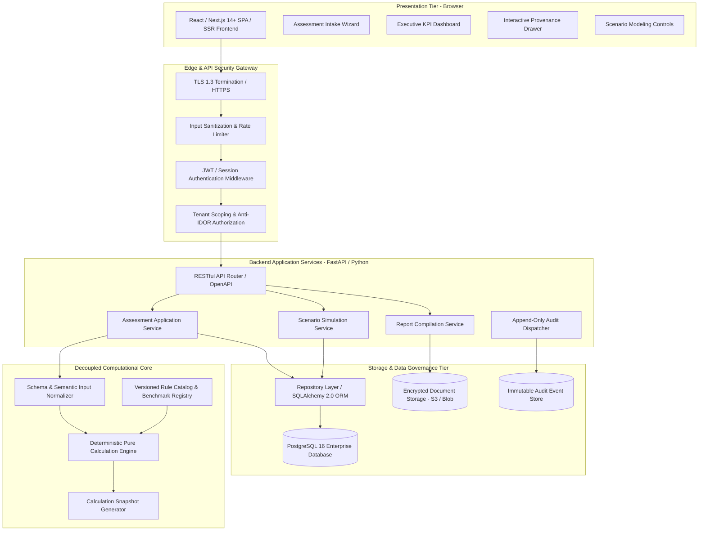
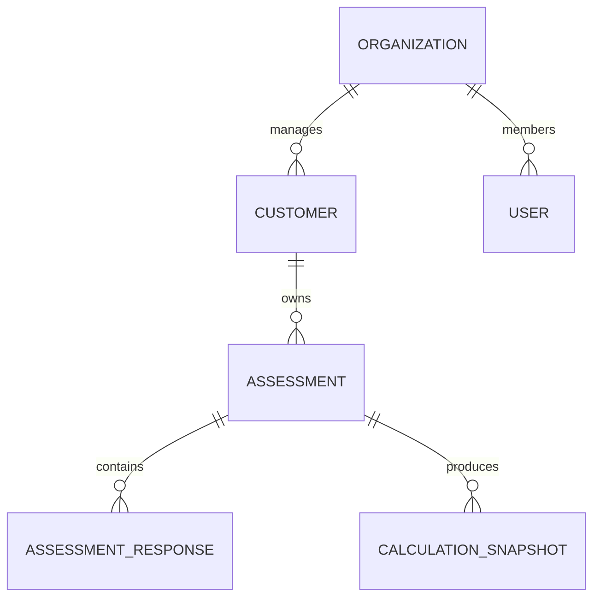
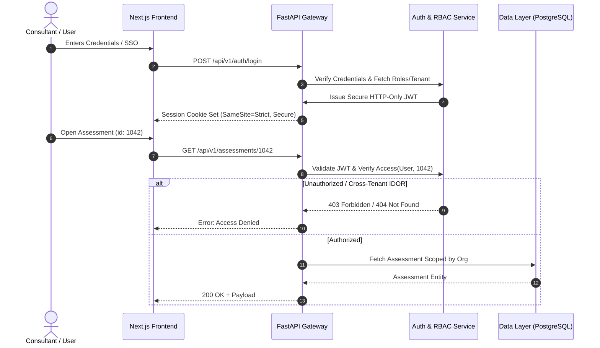
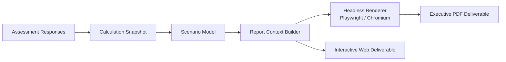

# Enterprise Technical Architecture Specification

> **Document Status**: `PHASE 1 ARCHITECTURE & DESIGN`  
> **Last Updated**: 2026-09-25  
> **Classification Standard**: `[CONFIRMED]`, `[INFERENCE]`, `[RECOMMENDATION]`, `[ARCHITECTURE DECISION REQUIRED]`

---

## 1. System Overview & Architectural Topology

`[CONFIRMED]` The **DATAEKO × meshIQ Partner Dashboard** is an enterprise multi-tier web application architected with strict separation of concerns, decoupling user interfaces from business calculation math, data storage, and reporting subsystems.



---

## 2. Layered Component Boundaries

```text
┌────────────────────────────────────────────────────────────────────────┐
│ 1. PRESENTATION LAYER (Next.js / React / TypeScript)                   │
│    • Assessment Intake Wizard & Section Stepper                        │
│    • Real-time client-side UX validation & Unknown/Skip toggles        │
│    • Executive KPI Dashboard & Scenario Sandbox Sliders                │
│    • Calculation Provenance Inspector Modals                           │
│    • Zero authoritative business calculation execution                │
├────────────────────────────────────────────────────────────────────────┤
│ 2. API & SECURITY GATEWAY LAYER (FastAPI / Pydantic / OpenAPI)         │
│    • Strict schema validation via typed request/response DTOs          │
│    • Token verification (JWT/OAuth2/SSO) & Context Injection           │
│    • Multi-tenant customer isolation & Object-Level Access (anti-IDOR) │
│    • Standardized error translation & HTTP status mapping              │
├────────────────────────────────────────────────────────────────────────┤
│ 3. APPLICATION SERVICE LAYER (Python Service Modules)                  │
│    • Assessment lifecycle orchestration (Draft → Calculated → Locked) │
│    • Scenario modeling coordination & delta tracking                   │
│    • Report artifact assembly & export triggering                      │
│    • Audit event dispatching on all state-mutating operations          │
├────────────────────────────────────────────────────────────────────────┤
│ 4. PURE DOMAIN & CALCULATION ENGINE (Headless Python Module)           │
│    • 100% headless, pure mathematical engine (Zero DB/HTTP/UI deps)    │
│    • Input normalization & explicit missingness token handling         │
│    • Versioned rule sets (`v1.0.0`) & benchmark tables                 │
│    • Controlled state resolution (`INSUFFICIENT_DATA`, `NOT_APPLICABLE`)│
│    • Guaranteed deterministic execution (Bit-for-bit reproducible)     │
├────────────────────────────────────────────────────────────────────────┤
│ 5. DATA ACCESS & PERSISTENCE LAYER (SQLAlchemy 2.0 / Alembic / PG)     │
│    • Tenant-scoped repository interfaces                               │
│    • Immutable calculation snapshots & versioned response entities     │
│    • Append-only audit logging tables                                  │
│    • Transactional consistency & relational integrity                 │
└────────────────────────────────────────────────────────────────────────┘
```

---

## 3. Technology Stack Evaluation & Recommendations

| Layer | Recommended Choice | Status | Key Rationale & Advantages | Alternatives Considered & Tradeoffs |
| :--- | :--- | :--- | :--- | :--- |
| **Frontend** | **Next.js 14+ / React / TypeScript** | `[RECOMMENDATION]` | Enterprise type-safety, rich component ecosystem for charts (Recharts/Tremor), built-in SSR for fast initial loads, robust API proxying. | • *Pure Vite React SPA*: Good, but lacks server-rendering for static reports.<br>• *Vue/Nuxt*: Viable, but React has broader enterprise UI chart ecosystems. |
| **Backend** | **Python 3.11+ / FastAPI** | `[RECOMMENDATION]` | Native support for complex mathematical calculation engines, Pydantic data validation, automatic OpenAPI specs, high performance async I/O. | • *Node.js / Express / NestJS*: Good for I/O, but Python is superior for analytical math, statistical modeling, and data science.<br>• *Go / Gin*: High performance, but slower development cycle for evolving calculation rules. |
| **Database** | **PostgreSQL 16** | `[RECOMMENDATION]` | Enterprise ACID compliance, native JSONB support for versioned calculation snapshots, Row-Level Security (RLS) for tenant isolation, robust indexing. | • *MySQL*: Weaker JSON querying.<br>• *MongoDB / NoSQL*: Lacks strong relational constraints needed for strict audit and customer data models. |
| **ORM & Migrations** | **SQLAlchemy 2.0 & Alembic** | `[RECOMMENDATION]` | Industry-standard async Python ORM, explicit migration history, strong typing with Pydantic integration (SQLModel). | • *Tortoise ORM*: Less mature migration tooling.<br>• *Raw SQL*: High maintenance overhead and security risk for complex queries. |
| **PDF Reporting** | **Headless Chromium (Playwright / Puppeteer) or WeasyPrint** | `[RECOMMENDATION]` | HTML/CSS to pixel-perfect PDF rendering, enabling shared React component styling across web dashboard and printed report deliverables. | • *ReportLab (Raw Python)*: Low maintenance ergonomics, difficult to match modern web CSS design.<br>• *Client-side PDF*: Inconsistent browser rendering. |
| **Testing** | **pytest (Backend) + Vitest / Playwright (Frontend & E2E)** | `[RECOMMENDATION]` | Parameterized unit testing for calculation engine, golden-master regression testing, full E2E lifecycle automation. | • *Jest*: Slower than Vitest.<br>• *Cypress*: Playwright is faster and has superior multi-browser/PDF testing. |
| **Containerization** | **Docker & Docker Compose** | `[RECOMMENDATION]` | Consistent local dev, staging, and production environments; deterministic dependency isolation. | • *Bare Metal*: Environment drift risks. |

---

## 4. Multi-Tenancy & Data Isolation Model

`[RECOMMENDATION]` **Hybrid Tenant-Scoped Relational Model**:



1. **Organization Boundary**: Top-level tenant (Dataeko, meshIQ, Partner Agency). Every user and customer belongs to an `organization_id`.
2. **Customer Boundary**: Enterprise undergoing assessment. Every assessment belongs to a `customer_id`.
3. **Defense-in-Depth Isolation**:
   * **Application Middleware**: Every incoming request injects `tenant_context` extracted from the verified session token.
   * **Repository Scoping**: All database queries automatically append `WHERE organization_id = :current_org_id` and `WHERE customer_id = :current_cust_id`.
   * **Object-Level Authorization (Anti-IDOR)**: Direct check `assert_can_access_assessment(user, assessment_id)` before read/write.
   * `[RECOMMENDATION]` **PostgreSQL Row-Level Security (RLS)**: Database-enforced isolation ensuring accidental omitting of query clauses fails closed.

---

## 5. Pure Headless Calculation Engine Architecture

`[CONFIRMED]` The Calculation Engine is implemented as a standalone, zero-dependency Python package (`core/calculation_engine`):

```text
core/calculation_engine/
├── __init__.py
├── engine.py                 # Pure calculation coordinator
├── normalizer.py             # Schema coercion & unknown token resolution
├── state_handler.py          # Controlled state evaluator (INSUFFICIENT_DATA, etc.)
├── models.py                 # Immutable Input & Output Data Transfer Objects
├── rules/
│   ├── base.py               # Abstract rule interface
│   ├── v1_0_0/               # Versioned rule catalog
│   │   ├── labor_rules.py
│   │   ├── outage_rules.py
│   │   ├── triage_rules.py
│   │   └── scenario_rules.py
│   └── benchmarks/
│       └── v1_0_0_benchmarks.json
└── tests/
    ├── test_labor_math.py
    ├── test_outage_math.py
    ├── test_missing_inputs.py
    └── test_golden_masters.py
```

### Execution Guarantee:
$$\text{OutputSnapshot} = f(\text{NormalizedInputs}, \text{RuleSetVersion}, \text{BenchmarkCatalogVersion})$$
* **No Database Calls**: Inputs are passed in-memory as typed structures.
* **Deterministic Output**: Given identical inputs and versions, output metrics, states, and provenance traces are bit-for-bit identical.

---

## 6. Authentication, RBAC & Security Design



---

## 7. API Architecture & RESTful Resource Boundaries

`[RECOMMENDATION]` Versioned REST API endpoints adhering to standard HTTP semantics:

| Route | Method | Purpose | Required Role |
| :--- | :---: | :--- | :--- |
| `/api/v1/auth/login` | `POST` | Authenticate user & issue session | Public |
| `/api/v1/auth/me` | `GET` | Current user profile, permissions & tenant | Authenticated |
| `/api/v1/customers` | `GET/POST` | List / Create customer accounts | Consultant, Admin |
| `/api/v1/assessments` | `GET/POST` | List / Initiate assessment engagement | Consultant, Admin |
| `/api/v1/assessments/{id}` | `GET/PATCH` | Read / Update assessment metadata & status | Consultant, Specialist |
| `/api/v1/assessments/{id}/questions` | `GET` | Fetch active question set with schema | Authenticated |
| `/api/v1/assessments/{id}/responses` | `GET/PUT` | Read / Batch upsert assessment responses | Consultant, Specialist |
| `/api/v1/assessments/{id}/calculate` | `POST` | Execute calculation engine & generate snapshot | Consultant, Specialist |
| `/api/v1/assessments/{id}/scenarios` | `POST/PUT` | Configure / Simulate optimization levers | Consultant, Specialist |
| `/api/v1/assessments/{id}/reports` | `POST` | Compile executive report artifact (PDF/Web) | Consultant, Specialist |
| `/api/v1/assessments/{id}/audit-logs`| `GET` | Retrieve audit trail for assessment | Consultant, Admin |

---

## 8. Reporting Architecture & Provenance Separation

`[CONFIRMED]` The reporting engine produces deliverables through a 4-stage pipeline:



### Visual Provenance Tags Rendered in Deliverables:
* `[CUSTOMER FACT]`: Direct measured telemetry provided during intake.
* `[MODEL ASSUMPTION]`: Operational baseline assumption (e.g., standard labor rates).
* `[BENCHMARK]`: Gartner/IDC/meshIQ industry baseline used in place of unknown metrics.
* `[CALCULATED]`: Pure deterministic calculation result.
* `[ILLUSTRATIVE PROJECTION]`: Future-state scenario modeling output (includes legal disclaimer).

---

## 9. Error Handling Architecture

`[CONFIRMED]` The system categorizes errors into clear, predictable response envelopes:

```json
{
  "error": {
    "code": "INSUFFICIENT_DATA",
    "category": "CALCULATION_VALIDATION",
    "message": "Cannot calculate Outage Downtime Exposure because critical incident count is unprovided.",
    "details": {
      "missing_fields": ["MQ_INCIDENTS_P1_ANNUAL"],
      "impacted_metrics": ["ANNUAL_OUTAGE_EXPOSURE_USD", "PROJECTED_SAVINGS_USD"],
      "remediation": "Enter estimated P1 incidents or enable benchmark assumption in settings."
    },
    "request_id": "req-8f92a1c0"
  }
}
```

---

## 10. Proposed Repository Directory Structure

```text
DATAEKO.AI-MESHIQ-partner_dashboard-/
├── .gitignore
├── README.md
├── docs/                             # Architecture & specification repository
│   ├── ARCHITECTURE.md
│   ├── architecture/                 # Architecture Decision Records (ADRs)
│   ├── ...                           # Domain docs (Phase 0B & 0C)
├── backend/                          # Python / FastAPI Backend Service
│   ├── pyproject.toml
│   ├── app/
│   │   ├── main.py                   # FastAPI Application Entrypoint
│   │   ├── api/v1/                   # REST API Routers
│   │   ├── core/                     # Config, security, database session
│   │   ├── calculation_engine/       # Pure, headless calculation package
│   │   ├── domain/                   # Business entities & interfaces
│   │   ├── services/                 # Application workflow services
│   │   ├── repositories/             # Database access layer
│   │   └── reports/                  # PDF generation templates & builder
│   └── tests/                        # Backend unit, integration & regression tests
├── frontend/                         # Next.js / TypeScript Web Application
│   ├── package.json
│   ├── src/
│   │   ├── app/                      # Next.js App Router (Pages & layouts)
│   │   ├── components/               # Reusable UI widgets, cards, charts
│   │   ├── features/                 # Wizard, Dashboard, Scenarios, Reports
│   │   ├── hooks/                    # Custom React hooks & state
│   │   ├── lib/                      # API client, utility functions
│   │   └── types/                    # TypeScript interfaces & DTOs
│   └── tests/                        # Vitest component & Playwright E2E tests
└── infra/                            # Infrastructure as Code & Docker
    ├── docker-compose.yml
    ├── backend.Dockerfile
    └── frontend.Dockerfile
```
