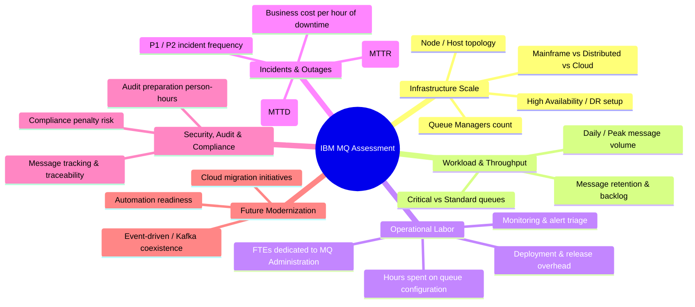

# Assessment Questions & Intake Framework

> **Document Status**: `FOUNDATION PHASE 0B`  
> **Last Updated**: 2026-09-25  
> **Classification Standard**: `[CONFIRMED]`, `[INFERENCE]`, `[RECOMMENDATION]`, `[OPEN QUESTION]`

---

## 1. Objective

`[CONFIRMED]` This document establishes the architectural framework, metadata schema, and handling rules for the IBM MQ Economic Cost & Efficiency Assessment questionnaire.

> **CRITICAL NOTICE**: The original IBM MQ Excel workbook is not yet provided. The concrete list of question prompts, formula parameters, and exact choices will be formally populated upon receipt of the business specification.

---

## 2. Core Intake Principles

1. `[CONFIRMED]` **Zero Data Coercion**: Missing, blank, or "Unknown" answers must **never** be coerced into `0`, `false`, or assumed defaults.
2. `[CONFIRMED]` **Explicit Unknown State**: The intake system must natively capture explicit uncertainty (e.g., `UNKNOWN`, `NOT_SURE`, `NOT_PROVIDED`, `DECLINED_TO_SHARE`).
3. `[CONFIRMED]` **Traceable Provenance**: Every response records who entered it, when, and whether it represents a direct customer measurement or consultant estimate.
4. `[CONFIRMED]` **Section Modularity**: Questions are partitioned into logical sections allowing non-linear completion and independent validation.

---

## 3. Question Metadata Schema Specification

`[RECOMMENDATION]` Every question in the assessment engine must adhere to the following schema definition:

```yaml
id: string                   # Unique immutable question identifier (e.g., "MQ_QUEUE_MANAGERS_TOTAL")
section_code: string         # Section grouping (e.g., "INFRA_SCALE", "INCIDENT_OPS")
order: integer               # Sequential display order within section
code: string                 # Human-readable mnemonic identifier
label: string                # Primary question text presented to user
description: string          # Supplementary context / explanation
tooltip: string              # Field-level guidance or examples
input_type: string           # NUMBER | INTEGER | CURRENCY | PERCENTAGE | BOOLEAN | SINGLE_SELECT | MULTI_SELECT | TEXT
unit_of_measure: string      # e.g., "Queue Managers", "Hours/Month", "USD", "FTE", "%"
validation:
  is_required: boolean       # If false, can be skipped or marked as unknown
  min_value: number | null   # Lower boundary
  max_value: number | null   # Upper boundary
  allowed_options: []        # For select types
  dependencies: []           # Conditional display logic based on previous answers
unknown_allowed: boolean     # If true, enables "Don't know / Not sure" toggle
data_classification: string  # CUSTOMER_FACT | MODEL_ASSUMPTION | BENCHMARK_OVERRIDE
version: string              # Schema version (e.g., "1.0.0")
```

---

## 4. Handling Unknown, Missing, and Partial Data

`[CONFIRMED]` In enterprise assessments, customer stakeholders frequently lack immediate figures for specific metrics (e.g., *exact monthly hours spent resolving stuck MQ messages*). The system must handle these gracefully:

| Intake State | Definition | System Handling | Calculation Impact |
| :--- | :--- | :--- | :--- |
| `PROVIDED` | Value explicitly entered by user. | Stored and validated against schema rules. | Used directly in calculation pipeline. |
| `UNKNOWN` | User explicitly clicked "I don't know / Not sure". | Flagged as `UNKNOWN`. Triggers optional benchmark fallback suggestion (with explicit disclaimer). | Dependent metrics marked `ESTIMATED_VIA_BENCHMARK` or `INSUFFICIENT_DATA`. |
| `NOT_PROVIDED` | Field left blank in an optional question. | Stored as `NULL` / `NOT_PROVIDED`. | Calculations depending on this parameter evaluate to `NOT_CALCULATED`. |
| `NOT_APPLICABLE` | Skipped due to conditional branching logic. | Stored as `N/A`. | Excluded from calculations cleanly. |

`[CONFIRMED]` **Strict Rule**: If a benchmark or model assumption is offered to fill an `UNKNOWN` value, the system must **never** overwrite the raw customer response. The benchmark must be stored in a separate scenario layer, maintaining audit distinction.

---

## 5. Expected Assessment Domain Sections

`[INFERENCE]` Based on enterprise IBM MQ operational cost models, the assessment questionnaire will span the following core operational dimensions (to be confirmed via the business specification):



---

## 6. Question Lifecycle & Immutability

`[CONFIRMED]`
* Once an assessment is marked `FINALIZED` or `LOCKED`, responses cannot be edited.
* If updates are required post-finalization, a new Assessment Revision (e.g., `v2`) must be branched from the original, preserving the baseline audit record.
* Question definitions themselves must be versioned. If a question's wording or calculation weight changes in a new release, historical assessments must remain bound to the question version they were created under.
