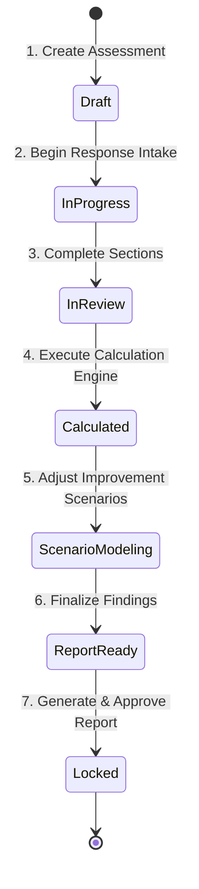

# Business Process & Operational Lifecycle

> **Document Status**: `FOUNDATION PHASE 0B`  
> **Last Updated**: 2026-09-25  
> **Classification Standard**: `[CONFIRMED]`, `[INFERENCE]`, `[RECOMMENDATION]`, `[OPEN QUESTION]`

---

## 1. Process Overview

`[CONFIRMED]` The primary business objective of the DATAEKO × meshIQ Partner Dashboard is to transform the legacy spreadsheet-based IBM MQ assessment into a standardized, repeatable, and scalable digital assessment lifecycle.

The process bridges three key stakeholder groups:
1. **Dataeko Consulting / Advisory Team**: Leads engagement, conducts interviews, and refines analysis.
2. **meshIQ Product Specialists**: Supplies benchmark models, product capabilities, and efficiency validation.
3. **Enterprise Customer Stakeholders**: Provides operational telemetry, infrastructure sizing, team topology, and cost baselines.

---

## 2. End-to-End Lifecycle Stages



### Stage 1: Engagement & Customer Account Setup
* `[CONFIRMED]` Organization/Customer profile is established.
* `[RECOMMENDATION]` Assign primary Dataeko Consultant and meshIQ Specialist to the customer profile.
* `[RECOMMENDATION]` Set engagement currency (e.g., USD, EUR, GBP, INR), timezone, and fiscal calendar preferences.

### Stage 2: Assessment Initialization
* `[CONFIRMED]` An Assessment instance is created with a unique identifier and linked to the customer.
* `[RECOMMENDATION]` Assessment selects a specific versioned Question Set and Calculation Rule Set.
* `[RECOMMENDATION]` Initial assessment status is set to `Draft`.

### Stage 3: Assessment Response Intake
* `[CONFIRMED]` Questionnaire is completed via a multi-step guided wizard or collaborative entry.
* `[CONFIRMED]` Responses must accommodate numeric, categorical, boolean, and explicit "Unknown" / "Not Provided" states.
* `[CONFIRMED]` Customer facts must remain pristine; no silent substitution with assumptions.
* `[RECOMMENDATION]` Support partial saves, auto-saving, and section completion indicators.

### Stage 4: Validation & Input Normalization
* `[CONFIRMED]` Responses are validated against schema boundaries, logical constraints, and dependencies.
* `[CONFIRMED]` Incomplete or missing values are normalized into explicit "Missing" / "Unknown" tokens—never coerced to `0` or false defaults.
* `[RECOMMENDATION]` Pre-calculation validation report informs consultant of missing variables affecting calculations.

### Stage 5: Calculation Engine Execution
* `[CONFIRMED]` Calculation engine processes normalized inputs using versioned business formulas and benchmark metrics.
* `[CONFIRMED]` If prerequisite data is missing, affected output metrics transition to controlled states (e.g., `INSUFFICIENT_DATA`, `NOT_MODELED`) rather than arithmetic errors.
* `[CONFIRMED]` Calculation results produce an immutable snapshot tied to the assessment version.

### Stage 6: Findings & Scenario Modeling
* `[CONFIRMED]` The system surfaces calculated cost drivers:
  * Annual MQ infrastructure TCO / maintenance overhead.
  * Operational FTE labor costs (troubleshooting, queue maintenance, deployments).
  * Outage & incident risk exposure.
  * Compliance and audit readiness costs.
* `[CONFIRMED]` Consultants can configure illustrative improvement scenarios (e.g., conservative 15% vs target 35% efficiency gains with meshIQ).
* `[CONFIRMED]` Scenarios are strictly labeled as *illustrative projections*, distinct from historical customer facts.

### Stage 7: Executive Report Generation & Approval
* `[CONFIRMED]` System compiles an executive customer report blending customer facts, calculated baselines, industry benchmark comparisons, and scenario projections.
* `[CONFIRMED]` Every metric in the report includes metadata showing its derivation and confidence level.
* `[RECOMMENDATION]` Report can be reviewed internally before publishing to customer-facing view or PDF export.

### Stage 8: Assessment Archival & Auditability
* `[CONFIRMED]` Once finalized, the assessment and its corresponding report are locked.
* `[CONFIRMED]` System maintains full audit history of responses, edits, editor identity, timestamps, and calculation revisions.

---

## 3. Stakeholder Interaction Matrix

| Stage | Dataeko Consultant | meshIQ Specialist | Customer User | Admin |
| :--- | :--- | :--- | :--- | :--- |
| **Customer Setup** | `[RECOMMENDATION]` Create/Assign | `[RECOMMENDATION]` View | `[RECOMMENDATION]` None | `[RECOMMENDATION]` Administer |
| **Response Intake** | `[CONFIRMED]` Facilitate / Input | `[INFERENCE]` Review / Assist | `[INFERENCE]` Direct Input / Review | `[RECOMMENDATION]` Full Access |
| **Validation** | `[CONFIRMED]` Resolve validation alerts | `[INFERENCE]` Review data quality | `[INFERENCE]` Clarify missing info | `[RECOMMENDATION]` Monitor |
| **Calculations** | `[CONFIRMED]` Trigger / Inspect | `[INFERENCE]` Validate outputs | `[INFERENCE]` Read-only results | `[RECOMMENDATION]` Configure rules |
| **Scenario Modeling** | `[CONFIRMED]` Adjust levers | `[CONFIRMED]` Validate levers | `[INFERENCE]` View scenarios | `[RECOMMENDATION]` Benchmark config |
| **Report Generation** | `[CONFIRMED]` Generate & Deliver | `[INFERENCE]` Co-brand / Validate | `[CONFIRMED]` Recipient | `[RECOMMENDATION]` Export / Audit |

---

## 4. Assessment Lifecycle State Machine

`[RECOMMENDATION]` Proposed state transitions:

```text
[DRAFT]
  │ (Start answering)
  ▼
[IN_PROGRESS]
  │ (All required sections addressed or flagged)
  ▼
[READY_FOR_CALCULATION]
  │ (Calculation executed successfully)
  ▼
[CALCULATED]
  │ (Optimization scenario configured)
  ▼
[SCENARIO_CONFIGURED]
  │ (Executive report compiled)
  ▼
[REPORT_PUBLISHED]
  │ (Final sign-off)
  ▼
[ARCHIVED / LOCKED]
```

`[CONFIRMED]` Transitioning backwards (e.g., from `CALCULATED` back to `IN_PROGRESS` to amend an answer) must automatically invalidate existing calculation snapshots or trigger a re-calculation warning to maintain audit integrity.
