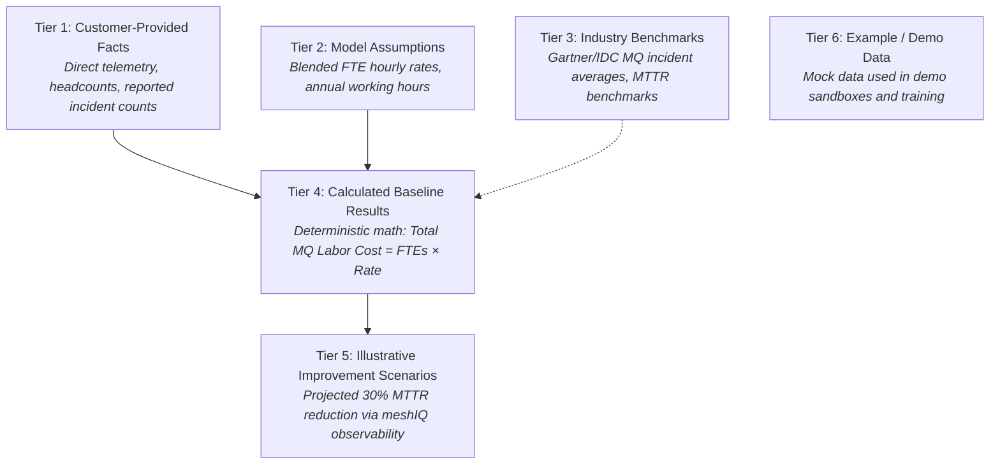

# Business Rules & Data Integrity Standards

> **Document Status**: `FOUNDATION PHASE 0B`  
> **Last Updated**: 2026-09-25  
> **Classification Standard**: `[CONFIRMED]`, `[INFERENCE]`, `[RECOMMENDATION]`, `[OPEN QUESTION]`

---

## 1. Core Principle: 6-Tier Data Classification

`[CONFIRMED]` To ensure absolute enterprise credibility, legal clarity, and audit compliance, every piece of data processed, stored, and displayed by the system belongs to one of six explicit tiers:



---

## 2. Mandatory Data Integrity Rules

### Rule BR-01: No Conflation of Projections with Guarantees
`[CONFIRMED]`
* Illustrative modeled savings (Tier 5) must **never** be presented as "guaranteed savings" or "actual contract savings."
* All UI screens, customer exports, and reports must clearly label projections with appropriate disclaimers (e.g., *"Illustrative efficiency scenario based on customer-provided baseline and estimated optimization percentages"*).

### Rule BR-02: No Presentation of Benchmarks as Customer Facts
`[CONFIRMED]`
* Industry benchmark statistics (Tier 3) cannot be represented as empirical facts about the customer's specific environment.
* If a customer has not measured their MTTR and the system utilizes an industry benchmark (e.g., *4.2 hours per MQ P1 incident*), this metric must be visibly badged as `[BENCHMARK ASSUMPTION]`.

### Rule BR-03: Prohibition of Silent Assumption Injection
`[CONFIRMED]`
* The system must **never** silently overwrite or replace customer-provided values with default model assumptions.
* If a user overrides a customer value with an assumption for exploratory modeling, both the original customer value and the modeled assumption value must be retained, compared, and clearly flagged.

### Rule BR-04: Full Mathematical Traceability
`[CONFIRMED]`
* Every calculated metric (Tier 4 & Tier 5) displayed in the application must provide an interactive "Calculation Provenance" breakdown displaying:
  * Exact formula executed.
  * Inputs utilized (identifying each input's tier: fact, assumption, or benchmark).
  * Version of the calculation rule set.
  * Timestamp of calculation execution.

---

## 3. Data Integrity & Validation Rules

`[RECOMMENDATION]` The application enforces the following baseline validation invariants:

| Category | Invariant Code | Validation Rule | Violation Handling |
| :--- | :--- | :--- | :--- |
| **Non-Negativity** | `VAL-NON-NEG` | Quantities (e.g., Queue Managers, FTEs, Incidents, Dollars) must be $\ge 0$. | Prevent input submission; show inline validation message. |
| **Percentage Boundaries** | `VAL-PCT-BOUND` | Efficiency and percentage levers must satisfy $0 \le x \le 100\%$ (unless negative growth is explicitly modeled). | Prevent input submission; show warning. |
| **Logical Consistency** | `VAL-LOGIC-01` | Number of dedicated MQ Admins cannot exceed Total Infrastructure IT Headcount. | Highlight warning; require consultant verification. |
| **Time Availability** | `VAL-HOURS-MAX` | Total reported admin hours per FTE per year cannot exceed physical maximum (e.g., 2,080 hours standard, or configured limit). | Flag outlier alert; prompt for confirmation. |
| **Outage Calculation** | `VAL-INCIDENT-01` | P1 Incidents cannot exceed Total Reported Incidents. | Hard validation error. |

---

## 4. Assessment Calculation States

`[CONFIRMED]` When calculating an assessment output where one or more parameters are unavailable or incomplete, the system must set the output state according to the following matrix:

```text
Input Availability                  Calculation Result State
────────────────────────────────────────────────────────────
All required inputs provided    ──> [CALCULATED_VALID]
Optional input missing,         ──> [CALCULATED_WITH_DEFAULTS] (Badged clearly)
  fallback assumption exists
Mandatory input marked UNKNOWN  ──> [INSUFFICIENT_DATA]
Input not applicable (branch)   ──> [NOT_APPLICABLE]
Mathematical invalidity (div 0) ──> [CANNOT_CALCULATE] (Logged to error subsystem)
```

`[CONFIRMED]` Under no circumstances should an end-user ever encounter raw code or spreadsheet errors (e.g., `NaN`, `undefined`, `#VALUE!`, `#DIV/0!`, `#REF!`).
