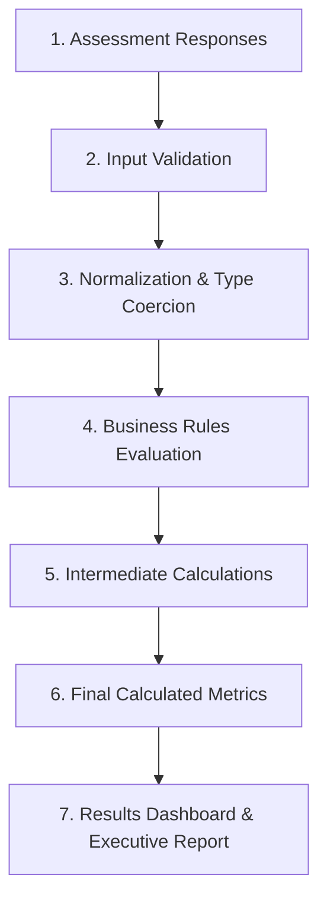

# Calculation Dependency Map

> **Document Status**: `VALIDATION PHASE 0C`  
> **Last Updated**: 2026-09-25  
> **Classification Standard**: `[CONFIRMED]`, `[INFERENCE]`, `[RECOMMENDATION]`, `[OPEN QUESTION]`, `[CONFLICT]`, `[MISSING INFORMATION]`

---

## 1. Computational Pipeline Architecture

The end-to-end data transformation pipeline flows strictly through the following stages:

---

## 2. Metric Dependency Breakdown

> **NOTICE**: While the architectural pipeline and metric categories are `[CONFIRMED]`, specific arithmetic dependency formulas below are marked `[OPEN QUESTION]` because the legacy IBM MQ workbook formulas are **not established by the current source material**.

### 2.1 Metric: Annual MQ Operational Labor Cost
* **Required Customer Inputs**: Dedicated MQ Administrators (FTEs), Routine maintenance hours.
* **Model Assumptions**: Blended MQ Admin Hourly Rate (`[OPEN QUESTION]`: default $/hr rate), Annual working hours per FTE (default 2,080 hrs/yr).
* **Benchmark Dependencies**: Industry average admin hours per 100 queue managers (used if maintenance hours = `UNKNOWN`).
* **Intermediate Calculations**:
  * Total Annual Admin Hours = `Dedicated FTEs * Annual Working Hours`
  * Fully Loaded Labor Cost = `Total Annual Admin Hours * Blended Hourly Rate`
* **Final Result**: `ANNUAL_MQ_LABOR_COST_USD`
* **Display Location**: Results Dashboard (Cost Breakdown Card), Executive Report (Section 3: Economic Cost Analysis).
* **Formula Status**: `[OPEN QUESTION]` — Requires exact formula from business specification.

---

### 2.2 Metric: Annual Outage & Downtime Cost Exposure
* **Required Customer Inputs**: Annual P1 / Critical Incidents, Annual P2 Incidents, Customer-reported Hourly Downtime Cost ($).
* **Model Assumptions**: Default hourly downtime cost if customer declines to provide (`[OPEN QUESTION]`).
* **Benchmark Dependencies**: Industry average Mean Time to Detect (MTTD) and Mean Time to Resolve (MTTR) for unmonitored MQ environments (`[OPEN QUESTION]`: e.g., 4.2 hours).
* **Intermediate Calculations**:
  * Total Annual Downtime Hours = `(P1 Count * MTTR_P1) + (P2 Count * MTTR_P2)`
  * Annual Outage Exposure = `Total Annual Downtime Hours * Hourly Downtime Cost`
* **Final Result**: `ANNUAL_OUTAGE_EXPOSURE_USD`
* **Display Location**: Results Dashboard (Risk Exposure Card), Executive Report (Section 3: Economic Cost Analysis).
* **Formula Status**: `[OPEN QUESTION]` — Requires exact formula from business specification.

---

### 2.3 Metric: Problem Triage & Lost Message Diagnosis Overhead
* **Required Customer Inputs**: Estimated monthly occurrences of stuck/undelivered messages, average engineers involved per incident.
* **Model Assumptions**: Blended engineering hourly triage rate.
* **Benchmark Dependencies**: Benchmark diagnosis time per stuck message incident (`[OPEN QUESTION]`).
* **Intermediate Calculations**:
  * Total Annual Triage Hours = `Monthly Occurrences * 12 * Hours per Occurrence * Engineers`
  * Total Triage Cost = `Total Annual Triage Hours * Blended Rate`
* **Final Result**: `ANNUAL_TRIAGE_OVERHEAD_USD`
* **Display Location**: Results Dashboard (Inefficiency Breakdown), Executive Report (Section 4: Operational Friction).
* **Formula Status**: `[OPEN QUESTION]` — Requires exact formula from business specification.

---

### 2.4 Metric: meshIQ Projected Annual Efficiency Savings (Scenario Modeling)
* **Required Inputs / Levers**:
  * Baseline Annual Operational Labor Cost (calculated above)
  * Baseline Outage Downtime Exposure (calculated above)
  * Scenario Optimization Levers:
    * Queue Configuration & Automation Efficiency % (e.g., 40%)
    * MTTR Reduction % via meshIQ 360-degree observability (e.g., 35%)
    * Alert Triage Automation % (e.g., 50%)
* **Model Assumptions**: Conservative vs Target vs Aggressive scenario preset configurations.
* **Benchmark Dependencies**: meshIQ proven customer case study efficiency averages.
* **Intermediate Calculations**:
  * Projected Labor Savings = `Baseline Labor Cost * Automation Efficiency %`
  * Projected Downtime Savings = `Baseline Outage Exposure * MTTR Reduction %`
  * Total Gross Projected Savings = `Projected Labor Savings + Projected Downtime Savings`
* **Final Result**: `PROJECTED_ANNUAL_SAVINGS_USD`, `RECLAIMED_FTE_CAPACITY_HOURS`
* **Display Location**: Executive KPI Cards, Scenario Slider Sandbox, Executive Report (Section 1 & 5).
* **Formula Status**: `[OPEN QUESTION]` — Requires exact scenario formulas from business specification.

---

### 2.5 Metric: Economic ROI & Payback Period
* **Required Inputs**: Total Gross Projected Savings ($), meshIQ Estimated Annual Solution Investment ($).
* **Model Assumptions**: Implementation timeline (e.g., 30–60 days).
* **Intermediate Calculations**:
  * Net Annual Benefit = `Total Gross Projected Savings - Solution Investment`
  * Return on Investment (ROI %) = `(Net Annual Benefit / Solution Investment) * 100`
  * Payback Horizon = `(Solution Investment / Total Gross Projected Savings) * 12 months`
* **Final Result**: `NET_ANNUAL_BENEFIT_USD`, `ROI_PERCENTAGE`, `PAYBACK_MONTHS`
* **Display Location**: Executive Summary Header, ROI Summary Table, Executive Report (Section 1).
* **Formula Status**: `[OPEN QUESTION]` — Requires exact pricing/ROI calculation logic from business specification.
