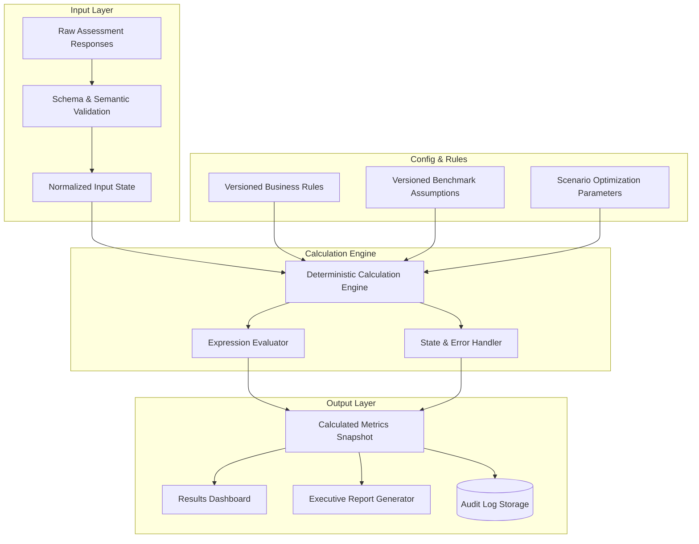

# Calculation Engine Architecture & Rules Framework

> **Document Status**: `FOUNDATION PHASE 0B`  
> **Last Updated**: 2026-09-25  
> **Classification Standard**: `[CONFIRMED]`, `[INFERENCE]`, `[RECOMMENDATION]`, `[OPEN QUESTION]`

---

## 1. Architectural Philosophy

`[CONFIRMED]` The Calculation Engine is the computational heart of the platform. It must be architected as a **pure, deterministic, headless computational service**, completely decoupled from the User Interface, presentation components, and network transports.



---

## 2. Calculation Pipeline Stages

`[CONFIRMED]` The computation lifecycle follows five sequential steps:

1. **Intake & Type Coercion**: Extracts raw values from response entities, mapping data to strictly typed domain structures (`Decimal`, `Integer`, `String`, `Option`).
2. **Missingness & Availability Resolution**: Determines which variables are `PROVIDED`, `UNKNOWN`, `NOT_PROVIDED`, or `N/A`.
3. **Baseline Economic Evaluation**:
   * Evaluates baseline infrastructure costs.
   * Evaluates operational labor expenditure.
   * Evaluates incident & downtime exposure.
   * Evaluates tooling & licensing overheads.
4. **Scenario Delta Modeling**:
   * Computes projected efficiency gains by applying scenario multipliers (e.g., MTTR reduction, queue automation efficiency) to baseline figures.
   * Calculates net economic benefit ($), reclaimed person-hours, and ROI horizon.
5. **Output Packaging & Provenance Stamping**:
   * Packages every output metric with metadata (formula ID, input map, rule version, calculation timestamp, execution status).

---

## 3. Controlled Output Error States

`[CONFIRMED]` The engine forbids unhandled arithmetic exceptions and spreadsheet-like error codes. Every computed metric evaluates to a structured wrapper:

```typescript
// Conceptual Interface (Not implementation code)
type CalculationState = 
  | 'VALID'                 // Successfully computed from verified inputs
  | 'VALID_WITH_DEFAULTS'   // Computed using benchmark fallback for optional variables
  | 'INSUFFICIENT_DATA'     // Cannot compute because mandatory variable is unknown/missing
  | 'NOT_APPLICABLE'        // Metric not applicable to current architecture topology
  | 'CANNOT_CALCULATE'      // Mathematical anomaly (e.g., division by zero intercepted)
  | 'NOT_MODELED';          // Feature or category excluded from scope

interface MetricResult<T> {
  value: T | null;
  state: CalculationState;
  stateReason?: string;
  formulaCode: string;
  ruleVersion: string;
  inputTrace: Record<string, { value: any; tier: string }>;
}
```

---

## 4. Expected Metric Calculation Categories

`[INFERENCE]` The future business specification for IBM MQ Economic Assessment is expected to include the following computational domains:

| Metric Category | Conceptual Inputs | Conceptual Outputs |
| :--- | :--- | :--- |
| **MQ Infrastructure Footprint** | `[INFERENCE]` Queue Managers, Queues, Channels, Clusters, OS Platforms | Total messaging footprint scale index. |
| **Operational Labor Cost** | `[INFERENCE]` Dedicated FTEs, MQ Admin salary/hourly rate, hours spent on routine maintenance | Annual Operational MQ Labor Cost ($). |
| **Incident & Outage Impact** | `[INFERENCE]` P1/P2 frequency, MTTD, MTTR, Hourly cost of outage | Annual MQ Outage Risk Exposure ($). |
| **Problem Diagnosis Overhead** | `[INFERENCE]` Hours spent tracking lost messages, diagnosing stuck queues | Message Triage & Root Cause Cost ($). |
| **meshIQ Improvement Scenarios** | `[INFERENCE]` Automation rate (%), MTTR reduction (%), Proactive alert efficiency (%) | Projected Annual Savings ($), Reclaimed FTE Capacity (Hours). |
| **Economic Payback & ROI** | `[INFERENCE]` Projected efficiency savings vs meshIQ investment | Net Benefit ($), ROI Multiplier (%), Payback Period (Months). |

> **IMPORTANT**: Exact mathematical formulas, weighting coefficients, and benchmark constants will be populated verbatim from the official business specification.

---

## 5. Calculation Engine Versioning & Immutability

`[CONFIRMED]`
* Every rule set is assigned a semantic version (e.g., `calc-rules-v1.0.0`).
* When an assessment is calculated, the active rule version is recorded in the calculation snapshot.
* Subsequent updates to calculation formulas **do not mutate** historical assessment results. Re-running calculations on an existing assessment requires creating an explicit revision or running a comparison simulation.
