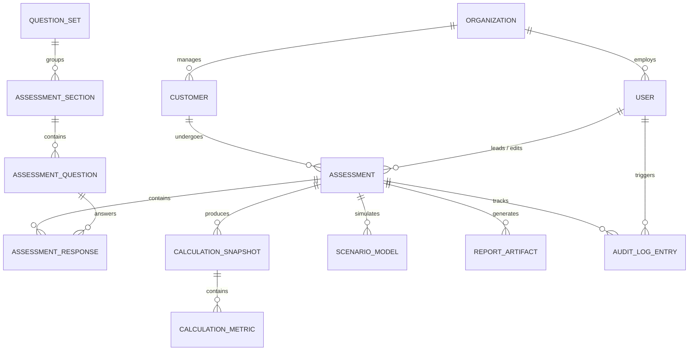

# Conceptual Data Model & Domain Entities

> **Document Status**: `FOUNDATION PHASE 0B`  
> **Last Updated**: 2026-09-25  
> **Classification Standard**: `[CONFIRMED]`, `[INFERENCE]`, `[RECOMMENDATION]`, `[OPEN QUESTION]`

---

## 1. Notice of Conceptual Scope

`[CONFIRMED]` This document defines the **conceptual domain entities and logical relationships**. It does **not** define physical database tables, SQL schemas, or ORM migrations. Final database models will be finalized once business specification formulas and data flows are verified.

---

## 2. Conceptual Entity-Relationship Diagram

---

## 3. Conceptual Entity Catalog

### 3.1 Organization
* **Purpose**: Top-level tenant or agency (e.g., Dataeko, meshIQ, Partner Agency).
* `[RECOMMENDATION]` **Conceptual Attributes**: `id`, `name`, `tenant_type` (PARTNER | VENDOR | ENTERPRISE), `status`, `created_at`.

### 3.2 User
* **Purpose**: Individual platform user (consultant, specialist, administrator, or customer contact).
* `[RECOMMENDATION]` **Conceptual Attributes**: `id`, `organization_id`, `email`, `full_name`, `role`, `is_active`, `last_login_at`.

### 3.3 Customer
* **Purpose**: Enterprise organization undergoing the IBM MQ assessment.
* `[RECOMMENDATION]` **Conceptual Attributes**: `id`, `organization_id`, `company_name`, `industry`, `geography`, `primary_contact_name`, `primary_contact_email`, `created_at`.

### 3.4 Assessment
* **Purpose**: An individual instance of an assessment engagement for a customer.
* `[RECOMMENDATION]` **Conceptual Attributes**:
  * `id`, `customer_id`, `title`, `engagement_currency`, `status` (`DRAFT`, `IN_PROGRESS`, `CALCULATED`, `LOCKED`, `ARCHIVED`).
  * `question_set_version`, `calculation_rules_version`.
  * `created_by_user_id`, `lead_consultant_id`, `created_at`, `finalized_at`.

### 3.5 Assessment Section
* **Purpose**: Logical grouping of related questions (e.g., Infrastructure, Incident Operations, Labor).
* `[RECOMMENDATION]` **Conceptual Attributes**: `id`, `question_set_id`, `section_code`, `title`, `description`, `sort_order`.

### 3.6 Assessment Question
* **Purpose**: Versioned question template.
* `[RECOMMENDATION]` **Conceptual Attributes**: `id`, `section_id`, `question_code`, `label`, `description`, `input_type`, `unit_of_measure`, `validation_rules`, `is_required`, `data_classification`, `version`.

### 3.7 Assessment Response
* **Purpose**: User-supplied or consultant-recorded answer to a specific question for an assessment.
* `[CONFIRMED]` **Conceptual Attributes**:
  * `id`, `assessment_id`, `question_id`.
  * `raw_value` (numeric, string, boolean, JSON).
  * `response_status` (`PROVIDED`, `UNKNOWN`, `NOT_PROVIDED`, `N_A`).
  * `data_tier` (`CUSTOMER_FACT`, `MODEL_ASSUMPTION`, `BENCHMARK_OVERRIDE`).
  * `notes` (consultant context or explanation).
  * `last_modified_by_user_id`, `updated_at`.

### 3.8 Calculation Snapshot
* **Purpose**: Immutable calculation output record generated by the Calculation Engine.
* `[CONFIRMED]` **Conceptual Attributes**:
  * `id`, `assessment_id`, `rule_set_version`, `engine_version`, `calculated_at`, `execution_status`.
  * `computed_metrics` (structured map of metrics, values, calculation states, and input traces).

### 3.9 Scenario Model
* **Purpose**: Illustrative optimization scenario configured by consultant.
* `[CONFIRMED]` **Conceptual Attributes**:
  * `id`, `assessment_id`, `snapshot_id`, `scenario_name` (e.g., "Conservative 15%", "Target 30%").
  * `efficiency_multipliers` (e.g., MTTR reduction %, queue automation %).
  * `projected_benefits` (annual dollar savings, reclaimed hours).

### 3.10 Report Artifact
* **Purpose**: Generated executive deliverable (Web view or exported PDF).
* `[CONFIRMED]` **Conceptual Attributes**:
  * `id`, `assessment_id`, `calculation_snapshot_id`, `scenario_model_id`, `format` (PDF | WEB), `file_path_or_url`, `generated_by_user_id`, `generated_at`.

### 3.11 Audit Log Entry
* **Purpose**: Immutable event log tracking every operational and data alteration.
* `[CONFIRMED]` **Conceptual Attributes**:
  * `id`, `assessment_id`, `user_id`, `action_type` (`RESPONSE_UPDATED`, `CALCULATION_EXECUTED`, `SCENARIO_SAVED`, `REPORT_GENERATED`).
  * `entity_name`, `entity_id`, `previous_state`, `new_state`, `ip_address`, `timestamp`.

---

## 4. Entity Immutability Rules

`[CONFIRMED]`
* `Audit Log Entry` is strictly **append-only**; never updated or deleted.
* `Calculation Snapshot` is **immutable**; recalculation creates a new snapshot.
* `Report Artifact` once generated is tied to a specific immutable `Calculation Snapshot`.
