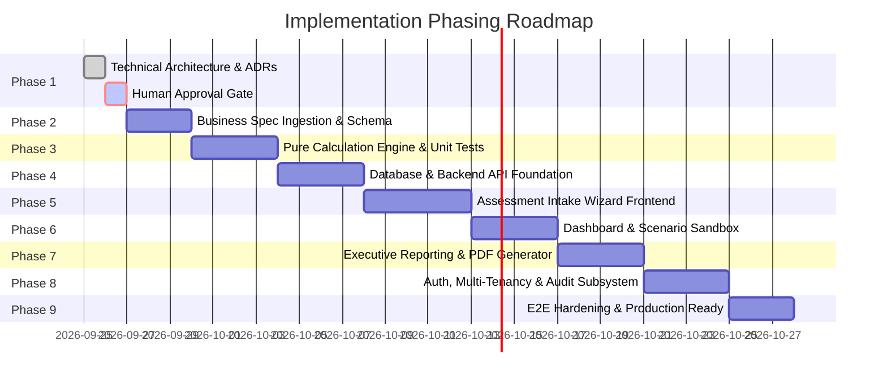

# Enterprise Implementation Roadmap

> **Document Status**: `PHASE 1 ARCHITECTURE & DESIGN`  
> **Last Updated**: 2026-09-25  
> **Classification Standard**: `[CONFIRMED]`, `[INFERENCE]`, `[RECOMMENDATION]`, `[OPEN QUESTION]`

---

## 1. Roadmap Strategy Overview

`[CONFIRMED]` The implementation roadmap follows a strict, risk-minimized, decoupled sequence. Crucially, **the pure calculation engine and domain business rules are implemented and verified via unit tests before the database, API, and UI are constructed**.

---

## 2. Phase-by-Phase Deliverables

### Phase 1: Architecture & Technical Foundation (Current)
* **Goal**: Establish enterprise architecture, technology stack recommendations, and Architecture Decision Records (ADRs).
* **Deliverables**: [`ARCHITECTURE.md`](file:///Users/sumit/Desktop/DATAEKO.AI-MESHIQ-partner_dashboard-/docs/ARCHITECTURE.md), `docs/architecture/ADR-001` through `ADR-007`, [`TECHNICAL_RISKS.md`](file:///Users/sumit/Desktop/DATAEKO.AI-MESHIQ-partner_dashboard-/docs/TECHNICAL_RISKS.md), [`IMPLEMENTATION_ROADMAP.md`](file:///Users/sumit/Desktop/DATAEKO.AI-MESHIQ-partner_dashboard-/docs/IMPLEMENTATION_ROADMAP.md).
* **Exit Gate**: Human architectural approval of recommended tech stack and ADRs.

### Phase 2: Business Specification Ingestion & Schema Definition
* **Goal**: Receive official IBM MQ markdown business specification; resolve open questions (`OQ-01` to `OQ-06`).
* **Deliverables**: Finalized question definitions, validation constraints, verbatim mathematical equations, and default benchmark datasets in `ASSESSMENT_QUESTIONS.md` and `CALCULATION_RULES.md`.

### Phase 3: Headless Calculation Engine Core & Unit Test Suite
* **Goal**: Build the zero-dependency, pure Python calculation engine.
* **Deliverables**: `core/calculation_engine` package with input normalizer, controlled state evaluator, and versioned rule catalogs.
* **Exit Gate**: $\ge 95\%$ unit test coverage and Golden Master regression tests verifying parity with legacy Excel models.

### Phase 4: Database Persistence & Backend API Services
* **Goal**: Implement PostgreSQL models, Alembic migrations, and FastAPI REST routers.
* **Deliverables**: SQLAlchemy 2.0 async models (Organizations, Customers, Assessments, Responses, Snapshots, Audit Logs), API endpoints for assessment lifecycle.

### Phase 5: Assessment Intake Wizard Frontend
* **Goal**: Build the Next.js multi-step assessment questionnaire interface.
* **Deliverables**: Interactive section stepper, responsive form inputs, explicit "Unknown / Not Sure" toggles, and auto-save capabilities.

### Phase 6: Executive KPI Dashboard & Scenario Sandbox
* **Goal**: Build executive visualization screens and interactive sensitivity sliders.
* **Deliverables**: Executive cost cards, interactive scenario levers (MTTR reduction, automation %), and Calculation Provenance inspection drawers.

### Phase 7: Executive Report Generation & PDF Export
* **Goal**: Implement server-side report compilation and high-resolution PDF generation.
* **Deliverables**: Branded executive summary reports, visual data tier badges (`[FACT]`, `[ASSUMPTION]`, `[BENCHMARK]`), and PDF download engine.

### Phase 8: Authentication, Multi-Tenancy, RBAC & Audit Logging
* **Goal**: Secure the platform with enterprise identity, tenant boundaries, and audit logging.
* **Deliverables**: JWT in HTTP-Only cookies, organization isolation middleware, anti-IDOR checks, and append-only audit event logging.

### Phase 9: E2E Integration, Observability & Production Readiness
* **Goal**: Perform comprehensive quality assurance, security penetration tests, and deployment packaging.
* **Deliverables**: Playwright E2E test suite, Docker Compose orchestration, structured logging, and deployment runbooks.
