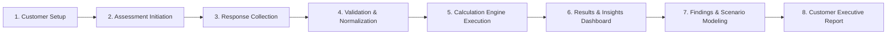

# DATAEKO × meshIQ Partner Dashboard — Project Overview

> **Document Status**: `FOUNDATION PHASE 0B`  
> **Last Updated**: 2026-09-25  
> **Classification Standard**: `[CONFIRMED]`, `[INFERENCE]`, `[RECOMMENDATION]`, `[OPEN QUESTION]`

---

## 1. Executive Summary

`[CONFIRMED]` The **DATAEKO × meshIQ Partner Dashboard** is an enterprise-grade digital platform designed to streamline, digitize, and scale the **IBM MQ Economic Cost & Efficiency Assessment** process.

Historically conducted via static spreadsheets (e.g., complex IBM MQ Excel workbooks), this platform elevates the assessment workflow into a secure, collaborative, auditable, and automated web solution. It empowers Dataeko consultants, meshIQ specialists, and enterprise customer stakeholders to collaboratively quantify messaging infrastructure costs, identify operational inefficiencies, model optimization opportunities, and generate high-impact executive reports.

`[CONFIRMED]` The application is **not** merely an Excel clone. It is architected as an enterprise web application with strict separation between business calculation logic, presentation, data governance, and customer reporting.

---

## 2. High-Level Business Workflow

`[CONFIRMED]` The end-to-end operational workflow follows a strict sequential pipeline:

### Workflow Stages:
1. **Customer Setup**: Provisioning or selecting an enterprise customer organization.
2. **Assessment Initiation**: Launching a targeted IBM MQ economic assessment instance with assigned consultants.
3. **Response Collection**: Interactive multi-step wizard capturing infrastructure scale, operational metrics, incident frequencies, and team overheads.
4. **Validation & Normalization**: Real-time syntactic and semantic validation, properly accommodating unknown or unprovided values.
5. **Calculation Engine Execution**: Pure, deterministic, versioned calculation processing of normalized inputs against business rules and benchmarks.
6. **Results & Insights Dashboard**: Dynamic visualization of calculated costs, labor expenditures, outage risks, and technical debt.
7. **Findings & Scenario Modeling**: Configurable optimization modeling comparing baseline metrics against projected meshIQ-enabled efficiencies.
8. **Customer Executive Report**: Automated generation of branded, auditable, executive-ready presentations and PDF deliverables.

---

## 3. Core Architectural & Business Principles

`[CONFIRMED]` The system is built around non-negotiable enterprise principles:

* **Separation of Concerns**: Complete isolation between calculation math, business rules, API services, and user interfaces.
* **Data Provenance & Traceability**: Explicit differentiation across data classifications (Customer Facts, Assumptions, Benchmarks, Calculations, Illustrative Scenarios).
* **Deterministic Calculations**: Identical inputs and rule versions must yield bit-for-bit identical outputs without side effects.
* **Auditability & Compliance**: Complete historical logging of every answer change, calculation version, and generated artifact.
* **Robust Error Handling**: Zero exposure of spreadsheet-style errors (`#VALUE!`, `#DIV/0!`). Incomplete data leads to graceful, well-defined application states.
* **Security & Isolation**: Multi-tenant or multi-organization data boundary isolation preventing any cross-customer data leakage.

---

## 4. Requirement Classification Taxonomy

Every statement, rule, entity, and metric within the project documentation is explicitly categorized using the following 4-tier taxonomy:

| Tag | Category | Definition | Action Required |
| :--- | :--- | :--- | :--- |
| `[CONFIRMED]` | **Confirmed Requirement** | Explicitly provided and verified business or architectural mandate. | Direct implementation upon phase start. |
| `[INFERENCE]` | **Inference** | Logical deduction derived from business context; pending formal confirmation. | Validate with stakeholders before code freeze. |
| `[RECOMMENDATION]` | **Engineering Recommendation** | Industry best practice or architectural recommendation proposed by the team. | Review with product & engineering leadership. |
| `[OPEN QUESTION]` | **Open Question** | Unresolved requirement, missing parameter, or ambiguous business logic. | Requires explicit business analyst / stakeholder answer. |

---

## 5. Scope of Phase 0B

`[CONFIRMED]` Phase 0B is strictly limited to **Project Foundation and Technical Documentation**.
* **Forbidden in this phase**: Writing UI code, backend services, database schemas/migrations, API endpoints, deploying infrastructure, or guessing proprietary workbook calculation formulas.
* **Deliverable in this phase**: Complete, structured documentation repository establishing the domain model, calculation architecture, security framework, testing strategy, and open questions catalog.

---

## 6. Documentation Map

| Document | Purpose |
| :--- | :--- |
| [`BUSINESS_PROCESS.md`](file:///Users/sumit/Desktop/DATAEKO.AI-MESHIQ-partner_dashboard-/docs/BUSINESS_PROCESS.md) | Detailed stakeholder lifecycle, assessment states, and handoffs. |
| [`ASSESSMENT_QUESTIONS.md`](file:///Users/sumit/Desktop/DATAEKO.AI-MESHIQ-partner_dashboard-/docs/ASSESSMENT_QUESTIONS.md) | Questionnaire framework, metadata structure, and unknown answer handling. |
| [`BUSINESS_RULES.md`](file:///Users/sumit/Desktop/DATAEKO.AI-MESHIQ-partner_dashboard-/docs/BUSINESS_RULES.md) | Data classification taxonomy, input validation, and business integrity rules. |
| [`CALCULATION_RULES.md`](file:///Users/sumit/Desktop/DATAEKO.AI-MESHIQ-partner_dashboard-/docs/CALCULATION_RULES.md) | Calculation engine architecture, pipeline, error states, and versioning. |
| [`REPORT_REQUIREMENTS.md`](file:///Users/sumit/Desktop/DATAEKO.AI-MESHIQ-partner_dashboard-/docs/REPORT_REQUIREMENTS.md) | Deliverable structure, provenance disclosures, and export requirements. |
| [`DATA_MODEL.md`](file:///Users/sumit/Desktop/DATAEKO.AI-MESHIQ-partner_dashboard-/docs/DATA_MODEL.md) | Conceptual domain entities, relationships, and lifecycle states. |
| [`USER_ROLES.md`](file:///Users/sumit/Desktop/DATAEKO.AI-MESHIQ-partner_dashboard-/docs/USER_ROLES.md) | Proposed user personas, permissions matrix, and role boundaries. |
| [`UI_UX_REQUIREMENTS.md`](file:///Users/sumit/Desktop/DATAEKO.AI-MESHIQ-partner_dashboard-/docs/UI_UX_REQUIREMENTS.md) | Wizard ergonomics, transparency UI, and dashboard visualization standards. |
| [`SECURITY_REQUIREMENTS.md`](file:///Users/sumit/Desktop/DATAEKO.AI-MESHIQ-partner_dashboard-/docs/SECURITY_REQUIREMENTS.md) | Authentication, authorization, multi-tenancy isolation, and audit specs. |
| [`TEST_PLAN.md`](file:///Users/sumit/Desktop/DATAEKO.AI-MESHIQ-partner_dashboard-/docs/TEST_PLAN.md) | Unit, integration, E2E, regression, and security verification plan. |
| [`OPEN_QUESTIONS.md`](file:///Users/sumit/Desktop/DATAEKO.AI-MESHIQ-partner_dashboard-/docs/OPEN_QUESTIONS.md) | Pending business questions, formula clarifications, and benchmark sources. |
| [`DECISIONS.md`](file:///Users/sumit/Desktop/DATAEKO.AI-MESHIQ-partner_dashboard-/docs/DECISIONS.md) | Architectural Decision Records (ADRs) tracking architectural commitments. |
