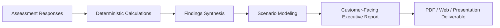

# Report Requirements & Deliverable Architecture

> **Document Status**: `FOUNDATION PHASE 0B`  
> **Last Updated**: 2026-09-25  
> **Classification Standard**: `[CONFIRMED]`, `[INFERENCE]`, `[RECOMMENDATION]`, `[OPEN QUESTION]`

---

## 1. Objective

`[CONFIRMED]` The Customer-Facing Report is the primary business deliverable generated by the platform. It translates technical assessment responses and mathematical calculation results into a compelling, clear, and executive-ready business case for C-level and IT leadership (CIO, CTO, VP of Infrastructure, Head of Middleware).



---

## 2. Mandatory Reporting Principles

1. `[CONFIRMED]` **Visual & Semantic Disambiguation**: The report must explicitly distinguish between:
   * **Customer Facts**: Real telemetry provided by customer.
   * **Model Assumptions**: Blended rates, working hours.
   * **Industry Benchmarks**: Typical industry metrics used when customer data was unavailable.
   * **Calculated Metrics**: Mathematical derivations.
   * **Illustrative Scenarios**: Hypothetical projected outcomes with meshIQ.
2. `[CONFIRMED]` **Prominent Legal & Commercial Disclaimers**: Every scenario page must include a standardized disclaimer clarifying that projected savings are illustrative estimates rather than contractual guarantees.
3. `[CONFIRMED]` **Reproducibility**: The report must display its Generation Timestamp, Assessment Version, and Calculation Rule Version in the document footer.

---

## 3. Standard Report Structure & Sections

`[RECOMMENDATION]` The generated report is structured into the following standardized modules:

```text
┌────────────────────────────────────────────────────────┐
│ 1. Executive Summary & Value Realization Dashboard     │
│    • Key Findings Snapshot                             │
│    • Current Baseline Cost vs Projected Savings        │
│    • Payback Horizon & ROI Summary                     │
├────────────────────────────────────────────────────────┤
│ 2. Customer Environment Baseline (Customer Facts)      │
│    • Queue Manager Count & Platform Topology           │
│    • Message Volume & Critical Queue Density           │
│    • Team Structure & Dedicated Admin Count            │
├────────────────────────────────────────────────────────┤
│ 3. Economic Cost Analysis (Calculated Metrics)         │
│    • Annual MQ Administration & Operations Cost        │
│    • Problem Diagnosis & Lost Message Overhead         │
│    • Incident & Outage Downtime Cost Exposure          │
├────────────────────────────────────────────────────────┤
│ 4. Operational Inefficiencies & Friction Points        │
│    • Mean Time to Resolve (MTTR) Breakdown             │
│    • Manual Queue Configuration & Deployment Overhead  │
│    • Audit, Compliance & Governance Burden             │
├────────────────────────────────────────────────────────┤
│ 5. meshIQ Optimization Scenarios (Illustrative)        │
│    • Conservative vs Target vs Aggressive Scenarios    │
│    • Reclaimed Engineering Capacity (Hours & FTEs)     │
│    • Outage Risk Mitigation Potential                  │
├────────────────────────────────────────────────────────┤
│ 6. Conclusion & Modernization Roadmap                  │
│    • Recommended Next Steps                            │
│    • Proof of Concept (POC) Milestone Proposal         │
├────────────────────────────────────────────────────────┤
│ 7. Methodology Appendix & Audit Traceability           │
│    • Full Disclosure of Formulas, Rates, & Benchmarks  │
│    • Calculation Version & Timestamp                   │
└────────────────────────────────────────────────────────┘
```

---

## 4. Visual Display Guidelines in Reports

`[RECOMMENDATION]` Reports must implement clear badge signposting for every displayed figure:

| Badge | Indicator Style | Meaning |
| :--- | :--- | :--- |
| `[FACT]` | Solid Green / Primary | Directly supplied by customer during intake. |
| `[ASSUMPTION]` | Slate Blue / Outline | Standard operational assumption (e.g., \$75/hr blended rate). |
| `[BENCHMARK]` | Amber / Badge | Gartner/IDC/meshIQ industry baseline. |
| `[CALCULATED]` | Solid Navy / Metric Card | Deterministic calculation from verified inputs. |
| `[PROJECTED]` | Purple / Dashed Border | Illustrative future-state efficiency scenario. |

---

## 5. Export Formats & Distribution Channels

`[RECOMMENDATION]` The reporting engine should support:
* **Interactive Web Report**: Real-time drilldown and toggleable scenario levers for live presentation during consultant-client meetings.
* **Executive PDF Export**: High-resolution, branded, print-ready document formatted in landscape or portrait layout.
* `[OPEN QUESTION]` **PowerPoint (PPTX) / Slide Export**: Does the business require direct export to editable PowerPoint slides for consultant customization?
