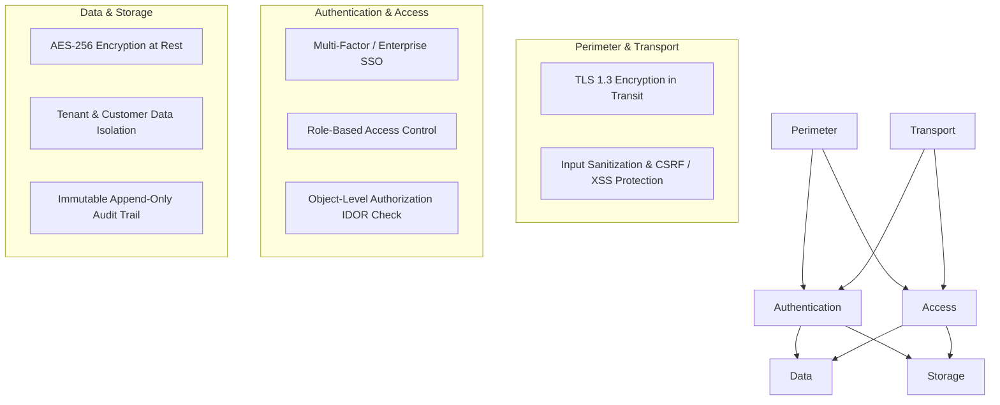

# Enterprise Security & Compliance Requirements

> **Document Status**: `FOUNDATION PHASE 0B`  
> **Last Updated**: 2026-09-25  
> **Classification Standard**: `[CONFIRMED]`, `[INFERENCE]`, `[RECOMMENDATION]`, `[OPEN QUESTION]`

---

## 1. Security Baseline & Threat Model

`[CONFIRMED]` The DATAEKO × meshIQ Partner Dashboard processes sensitive commercial, architectural, financial, and operational telemetry of enterprise customers. Protecting customer confidentiality, preventing cross-tenant data leakage, and ensuring audit compliance are non-negotiable requirements.

---

## 2. Core Security Requirements

### 2.1 Authentication & Session Governance
* `[CONFIRMED]` Strong authentication with password complexity enforcement, secure session token handling (HTTP-only, Secure, SameSite cookies), and configurable session inactivity timeouts.
* `[RECOMMENDATION]` Future integration with Enterprise Single Sign-On (SAML 2.0 / OIDC / OAuth2) for Dataeko, meshIQ, and customer organizations.

### 2.2 Authorization & Multi-Tenant Data Isolation
* `[CONFIRMED]` **Strict Boundary Isolation**: Users belonging to Organization A must never query, view, or modify assessments, customers, or responses belonging to Organization B.
* `[CONFIRMED]` **Object-Level Authorization**: Every API request must verify ownership and permission at the record level, preventing Insecure Direct Object Reference (IDOR) attacks (e.g., verifying user has access to `assessment_id` before reading responses).

### 2.3 Input Validation & Sanitization
* `[CONFIRMED]` Strict schema-based validation on all incoming payloads (preventing SQL Injection, NoSQL Injection, and Command Injection).
* `[CONFIRMED]` Sanitization of rich-text notes and export templates to prevent Cross-Site Scripting (XSS) and PDF injection vulnerabilities.

### 2.4 Secrets Management & Git Hygiene
* `[CONFIRMED]` **Zero Secrets in Git**: No API keys, JWT secrets, database passwords, encryption keys, or credentials may ever be committed to the Git repository.
* `[CONFIRMED]` Environment variables and external key management solutions (e.g., AWS Secrets Manager, Vault, or Cloud Secret Manager) must be used across all environments.
* `[CONFIRMED]` A robust `.gitignore` must be maintained at all times.

### 2.5 Encryption Standards
* `[CONFIRMED]` **In Transit**: All network communications enforced via TLS 1.3 (minimum TLS 1.2).
* `[CONFIRMED]` **At Rest**: Sensitive database volumes, backups, and generated report artifacts encrypted with AES-256.

### 2.6 Comprehensive Audit Logging
* `[CONFIRMED]` The system must record an append-only audit trail capturing:
  * Actor ID (who).
  * Action Type (create, update, calculate, export, delete).
  * Target Entity & ID.
  * State diff (previous value vs new value).
  * IP address, User-Agent, and Timestamp.
* `[CONFIRMED]` Audit logs must be tamper-resistant and preserved according to enterprise retention policies.

### 2.7 Secure Report Generation & Sharing
* `[CONFIRMED]` Customer report downloads and links must be access-controlled and time-limited.
* `[RECOMMENDATION]` Watermarking options for draft or confidential assessments to prevent unauthorized document circulation.

---

## 3. OWASP Top 10 Mitigation Matrix

| Vulnerability | Platform Mitigation Strategy |
| :--- | :--- |
| **A01: Broken Access Control** | Object-level middleware checks on all routes; multi-tenant tenant-scoping in all queries. |
| **A02: Cryptographic Failures** | Strong cipher suites, salted hashing (Argon2/bcrypt) for passwords, AES-256 for artifacts. |
| **A03: Injection** | Parameterized queries, schema validation, output encoding for report builders. |
| **A04: Insecure Design** | Threat modeling at foundation phase; separation of calculation engine from UI. |
| **A05: Security Misconfiguration** | Hardened headers (HSTS, CSP, X-Content-Type-Options), least-privilege cloud IAM. |
| **A06: Vulnerable Components** | Automated dependency scanning (e.g., Dependabot, npm audit, Snyk). |
| **A07: Auth Failures** | Rate limiting on login endpoints, lockout policies, secure session revocation. |
| **A08: Software & Data Integrity** | Versioned calculation rules, checksums on exported documents. |
| **A09: Logging & Monitoring Failures** | Structured centralized audit logging without capturing raw credentials. |
| **A10: SSRF** | Restrict server-side outbound requests; strict URL whitelisting for webhook integrations. |
