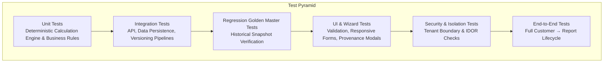

# Enterprise Test Plan & Quality Assurance Strategy

> **Document Status**: `FOUNDATION PHASE 0B`  
> **Last Updated**: 2026-09-25  
> **Classification Standard**: `[CONFIRMED]`, `[INFERENCE]`, `[RECOMMENDATION]`, `[OPEN QUESTION]`

---

## 1. Quality Strategy Overview

`[CONFIRMED]` The DATAEKO × meshIQ Partner Dashboard requires a rigorous, multi-layered quality engineering strategy. Because executive purchasing decisions and multi-million dollar infrastructure budgets rely on these assessments, computational precision, stability, and security are paramount.



---

## 2. Test Hierarchy & Scope

### 2.1 Unit Testing (Calculation Engine & Business Rules)
* `[CONFIRMED]` **Pure Mathematical Testing**: Verify that every economic calculation formula behaves predictably across wide input domains.
* **Edge Case Verification**:
  * Extreme values (e.g., 0 Queue Managers vs 10,000 Queue Managers).
  * Incomplete inputs (`UNKNOWN`, `NOT_PROVIDED`, `N/A`) ensuring transition to controlled states (`INSUFFICIENT_DATA`) without arithmetic errors.
  * Decimal precision and rounding verification across multi-currency conversions.
* `[RECOMMENDATION]` Target unit test code coverage: $\ge 95\%$ for the Calculation Engine core.

### 2.2 Golden Master / Regression Testing
* `[CONFIRMED]` **Formula Version Stability**: A suite of reference assessment test fixtures ("Golden Masters") will be maintained.
* Whenever calculation algorithms or business rules are modified, regression tests execute against historical fixture inputs to confirm that legacy rule versions produce identical historical snapshots.

### 2.3 Integration Testing
* `[RECOMMENDATION]` **API & Persistence Verification**:
  * Assessment lifecycle state machine transitions (`DRAFT` → `IN_PROGRESS` → `CALCULATED` → `LOCKED`).
  * Invalidation triggers (updating a response on a calculated assessment resets or warns about calculation status).
  * Audit log generation on every mutating operation.

### 2.4 UI & Interaction Testing
* `[RECOMMENDATION]` **Form & Ergonomics Verification**:
  * Step-by-step wizard navigation, section completion indicators, and progress calculation.
  * Real-time validation feedback on out-of-bound inputs.
  * Responsive layout rendering across desktop and presentation tablets.
  * Metric Derivation / Provenance modal trigger and display accuracy.

### 2.5 End-to-End (E2E) Testing
* `[CONFIRMED]` **Complete Engagement Lifecycle**:
  ```text
  Create Customer
    ──> Initiate Assessment
    ──> Complete Wizard (mixed facts + unknown toggles)
    ──> Execute Calculation Engine
    ──> Configure Scenario Levers
    ──> Verify Results Dashboard
    ──> Generate & Verify PDF Report Output
  ```

### 2.6 Security & Penetration Testing
* `[CONFIRMED]` **Tenant Boundary Isolation**: Automated assertions that User Org A receives `403 Forbidden` / `404 Not Found` when attempting to access User Org B's assessments or customers.
* **IDOR Prevention**: Parameter tampering on all record IDs.
* **Injection & Sanitization**: Verifying XSS sanitization in assessment notes and PDF generation templates.

---

## 3. Test Fixture & Scenario Specifications (Proposed)

`[RECOMMENDATION]` Representative test fixture profiles to be implemented:

| Fixture Code | Environment Archetype | Profile Description | Key Test Goal |
| :--- | :--- | :--- | :--- |
| `FIX-01-STANDARD` | Mid-Market Financial | 25 QMgrs, 4 dedicated FTEs, standard incident frequency | Verify standard calculation pathway |
| `FIX-02-ENTERPRISE`| Global Tier 1 Bank | 450 QMgrs, Mainframe + Cloud, 25 FTEs, high outage cost | Verify large scale & high downtime risk math |
| `FIX-03-SPARSE` | Incomplete Intake | 10 QMgrs, all labor fields marked `UNKNOWN` | Verify graceful `INSUFFICIENT_DATA` state |
| `FIX-04-BOUNDARY` | Zero Outages | 5 QMgrs, 0 recorded P1 incidents, 0 downtime | Verify no division by zero in MTTR/outage models |
