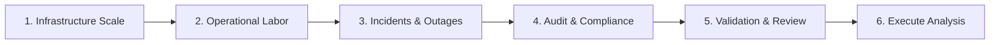

# UI/UX & Interaction Design Requirements

> **Document Status**: `FOUNDATION PHASE 0B`  
> **Last Updated**: 2026-09-25  
> **Classification Standard**: `[CONFIRMED]`, `[INFERENCE]`, `[RECOMMENDATION]`, `[OPEN QUESTION]`

---

## 1. Design Vision & Guiding Principles

`[CONFIRMED]` The user interface for the DATAEKO × meshIQ Partner Dashboard must deliver an enterprise-grade, polished, and intuitive experience for executive presentations and technical assessments alike.

Key principles:
1. **Clarity Over Complexity**: Large spreadsheets overwhelm stakeholders; the dashboard should present crisp summaries with progressive disclosure for deep technical details.
2. **Confidence & Transparency**: Every metric must offer on-demand transparency showing exactly where numbers came from.
3. **Ergonomic Assessment Intake**: Minimize survey fatigue through structured sections, intuitive inputs, clear unit labels, and explicit "Unknown" toggles.
4. **No Cryptic Failure States**: Provide actionable, human-readable guidance instead of raw errors.

---

## 2. Assessment Intake Wizard UX



### 2.1 Wizard Capabilities
* `[RECOMMENDATION]` **Section Navigation**: Left-hand stepper sidebar indicating section status (`Complete`, `In Progress`, `Pending`, `Has Warnings`).
* `[CONFIRMED]` **Native Unknown Toggle**: Every optional or estimable field includes an accessible toggle:
  ```text
  [ ] I don't know / Not sure at this time
  ```
  Selecting this explicitly switches the field into the `UNKNOWN` state without throwing validation blockers.
* `[RECOMMENDATION]` **Field Tooltips & Explanations**: Contextual popovers explaining *why* this metric matters and giving typical enterprise ranges.
* `[RECOMMENDATION]` **Auto-Save & Draft State**: Continuous local/cloud draft saving to prevent loss of customer interview data during live sessions.

---

## 3. Results Dashboard & Visualization UX

`[RECOMMENDATION]` The executive dashboard is divided into three core visual tiers:

```text
┌──────────────────────────────────────────────────────────────────────────┐
│  EXECUTIVE KPI SUMMARY                                                   │
│  ┌──────────────────┐  ┌──────────────────┐  ┌────────────────────────┐  │
│  │ Current MQ TCO   │  │ Projected Savings│  │ Reclaimed Labor Cap.   │  │
│  │ $1,420,000 / yr  │  │ $410,000 / yr    │  │ 2.4 FTEs / 4,990 hrs   │  │
│  │ [CALCULATED]     │  │ [PROJECTED - 29%]│  │ [PROJECTED]            │  │
│  └──────────────────┘  └──────────────────┘  └────────────────────────┘  │
├──────────────────────────────────────────────────────────────────────────┤
│  INTERACTIVE SCENARIO MODELING (LEVERS)                                  │
│  MTTR Reduction:  [─────●──────] 35%                                     │
│  Queue Automation:[───────●────] 50%                                     │
│  Proactive Alerts:[────●───────] 25%                                     │
├──────────────────────────────────────────────────────────────────────────┤
│  DETAILED COST BREAKDOWN                                                 │
│  • Operational Maintenance FTE Cost    $720,000   (Click for derivation) │
│  • Outage & Incident Downtime Risk     $450,000   (Click for derivation) │
│  • Problem Triage & Audit Prep         $250,000   (Click for derivation) │
└──────────────────────────────────────────────────────────────────────────┘
```

### 3.1 Metric Derivation Modal (Provenance)
`[CONFIRMED]` Clicking on any calculated metric opens a drawer/modal displaying:
* **Formula Code**: `MQ_LABOR_COST = Dedicated_FTEs * Blended_Hourly_Rate * Annual_Hours`
* **Values Used**: `4 FTEs * $85.00/hr [ASSUMPTION] * 2,080 hrs [STANDARD]`
* **Calculation State**: `VALID`
* **Rule Engine Version**: `v1.0.0`

---

## 4. Visual Aesthetics & Design System Foundations

`[RECOMMENDATION]` Recommended enterprise styling specifications:
* **Typography**: Clean, modern sans-serif typography (e.g., Inter, Outfit, or Roboto).
* **Color Palette**:
  * Brand Primary: Deep Navy / Slate (`#0F172A`, `#1E293B`)
  * meshIQ Accent / Energy: High-contrast Blue / Teal (`#0284C7`, `#0EA5E9`)
  * Dataeko Warmth / Success: Forest / Emerald Green (`#059669`, `#10B981`)
  * Warning / Assumptions: Amber (`#D97706`, `#F59E0B`)
  * Incomplete / Error: Ruby Red (`#DC2626`)
* **Accessibility**: Strict WCAG AA contrast compliance across all charts, badge tags, and forms.
