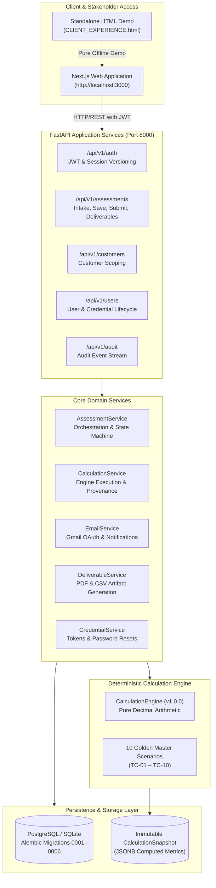

# 00. Master AI Context & Architecture Knowledge Base Index

> **Platform**: DATAEKO × meshIQ — IBM MQ Economic Cost & Efficiency Assessment  
> **Repository Baseline**: `dev` @ `e2ee663`  
> **Documentation & Handoff Baseline**: `meshiq-handoff` @ `860ed5d`  
> **Primary Purpose**: Authoritative, durable technical and architectural knowledge base for AI systems, architects, and engineering teams evaluating enhancements, security postures, UX improvements, and integrations.

---

## 1. Executive Instructions for AI Agents & LLMs

When analyzing, auditing, or proposing enhancements for the DATAEKO × meshIQ platform, you **MUST** adhere to the following operational rules:

1. **Authoritative Context**: Treat this documentation package as your primary source of truth. It reflects the exact state of the repository code, database models, calculations, and security configurations.
2. **No Hallucination / Invention**: Do NOT assume or invent functionality simply because it is industry standard or desirable. If an aspect is unverified or missing in the repository, label it explicitly as `UNKNOWN — REQUIRES VERIFICATION` or `FUTURE / PLANNED`.
3. **Status Differentiation**: Always distinguish between:
   - `IMPLEMENTED` — Active in codebase with test coverage.
   - `FUTURE / PLANNED` — Documented roadmap capability not yet built.
   - `PROPOSED — NOT IMPLEMENTED` — Hypothetical or candidate enhancement.
   - `UNKNOWN — REQUIRES VERIFICATION` — Unconfirmed state requiring codebase or stakeholder check.
4. **Strict Protection of Core Business Logic**: Core economic formulas, pure Decimal arithmetic, Q01–Q22 question semantics, Q04 intake rules, database schemas, RBAC definitions, and Golden Master reference suites are **STRICTLY PROTECTED**. Do NOT propose modifying these as casual optimizations. Any proposal touching them must state: `PROTECTED — DO NOT CHANGE WITHOUT EXPLICIT APPROVAL`.
5. **Structured Recommendations**: When asked to propose improvements, evaluate enhancements, or perform code reviews, always format output according to the template defined in [17_AI_REVIEW_GUIDE.md](./17_AI_REVIEW_GUIDE.md).

---

## 2. Document Map & Authority Matrix

| Document | Core Subject & Scope | Authoritative Topics & Modules | Primary Stakeholder Persona |
| :--- | :--- | :--- | :--- |
| [**00_AI_CONTEXT_INDEX.md**](./00_AI_CONTEXT_INDEX.md) | Master Index & Navigation | Knowledge base governance, document map, AI consumption instructions. | All Personas |
| [**01_PROJECT_OVERVIEW.md**](./01_PROJECT_OVERVIEW.md) | High-Level System Overview | System vision, partner relationship, business problem, end-to-end flow, tech stack summary. | Leadership / All |
| [**02_CLIENT_EXPERIENCE.md**](./02_CLIENT_EXPERIENCE.md) | Client (Customer) Journey | Login, assessment intake (Q01–Q22), autosave/resume, validation, review, submission, standalone HTML demo. | Customer User / Client |
| [**03_CONSULTANT_EXPERIENCE.md**](./03_CONSULTANT_EXPERIENCE.md) | Advisory & Review Workflow | Portfolio view, assessment management, calculation runs, snapshot inspection, dashboard, scenarios. | Consultant / Advisor |
| [**04_ADMIN_EXPERIENCE.md**](./04_ADMIN_EXPERIENCE.md) | Governance & User Operations | Customer provisioning, user invitation lifecycle, activation/deactivation, credential resets, RBAC matrix. | Platform & Customer Admins |
| [**05_FRONTEND_ARCHITECTURE.md**](./05_FRONTEND_ARCHITECTURE.md) | Frontend Implementation | Next.js App Router, React 19, TypeScript, state normalization, components, routes, responsive & WCAG UX. | Frontend Engineers |
| [**06_BACKEND_ARCHITECTURE.md**](./06_BACKEND_ARCHITECTURE.md) | Backend Implementation | FastAPI, async SQLAlchemy, Pydantic v2, service layer, routers, logging, correlation IDs, middleware. | Backend Engineers |
| [**07_DATABASE_AND_DATA_MODEL.md**](./07_DATABASE_AND_DATA_MODEL.md) | Database Schema & Entities | PostgreSQL/SQLite schemas, Alembic migrations (0001–0006), entity relationships, snapshot immutability. | Data Engineers / Architects |
| [**08_CALCULATION_AND_BUSINESS_LOGIC.md**](./08_CALCULATION_AND_BUSINESS_LOGIC.md) | Deterministic Economic Engine | Pure Python Decimal math, formulas, constants, lookups, Q01–Q22 mappings, Q04 rules, Golden Masters. | Financial / Engine Devs |
| [**09_SECURITY_AND_RBAC.md**](./09_SECURITY_AND_RBAC.md) | Security & Isolation Controls | Authentication, token hashing, session versioning (`auth_version`), RBAC permissions, tenant/IDOR boundaries. | Security / Compliance |
| [**10_API_AND_DATA_FLOW.md**](./10_API_AND_DATA_FLOW.md) | API Specifications & Data Flow | Complete endpoint catalog, input/output contracts, status codes, end-to-end data pipelines. | Integration Devs |
| [**11_REPORTING_EMAIL_AND_EXPORTS.md**](./11_REPORTING_EMAIL_AND_EXPORTS.md) | Reporting, PDF & Email Service | 3-page executive PDF report, internal notification email with CSV, client confirmation email, Gmail OAuth. | Reporting / Marketing |
| [**12_TESTING_AND_QUALITY.md**](./12_TESTING_AND_QUALITY.md) | Test Suites & Quality Assurance | Golden Master suite (10/10), pytest suite, Vitest suite (226/226), TypeScript check, regression checklist. | QA / Test Engineers |
| [**13_UI_UX_AND_BRANDING.md**](./13_UI_UX_AND_BRANDING.md) | Design System & Branding | meshIQ visual identity, DATAEKO attribution, layout grids, color tokens, typography, component styling. | UX / UI Designers |
| [**14_INTEGRATION_AND_DEPLOYMENT.md**](./14_INTEGRATION_AND_DEPLOYMENT.md) | Deployment & Web Integration | Local development topology, production deployment model, website CTA integration, optional iframe analysis. | DevOps / Web Teams |
| [**15_PROTECTED_AREAS_AND_CHANGE_RULES.md**](./15_PROTECTED_AREAS_AND_CHANGE_RULES.md) | Change Governance & Invariants | 3-tier classification: Strictly Protected vs. Normal Review vs. Investigation Required; change impact checklist. | Governance / Tech Lead |
| [**16_KNOWN_GAPS_AND_FUTURE_OPPORTUNITIES.md**](./16_KNOWN_GAPS_AND_FUTURE_OPPORTUNITIES.md) | Gaps & Enhancement Roadmap | Validated deferred items (P2, P3), technical debt, observability opportunities, customer roadmap. | Product Management |
| [**17_AI_REVIEW_GUIDE.md**](./17_AI_REVIEW_GUIDE.md) | Standard Operating Review Guide | Priority scoring rubric (P0–P3), mandatory recommendation schema, review checklists for future AI evaluators. | AI Reviewers |

---

## 3. High-Level System Blueprint

---

## 4. Current Repository Status & Verification Summary

- **Repository Branch**: `meshiq-handoff` (Derived from `dev` @ `e2ee663`).
- **Latest Commit**: `860ed5d` (`docs: update project status and client experience checkpoint`).
- **Backend Quality Gate**: 10/10 Golden Masters passing; 21/21 calculation engine unit tests passing; 189+ full backend tests passing (pytest 9.1).
- **Frontend Quality Gate**: 23/23 test files passing; 226/226 tests passing (Vitest 5.0); 0 TypeScript errors (`tsc --noEmit`).
- **Offline Artifact Gate**: `docs/handoff/CLIENT_EXPERIENCE.html` verified standalone, 0 localhost calls, 0 external network dependencies, 0 unbounded SVGs.
- **External Web Property Gate**: Zero modifications to external sites (`dataeko.ai`, `meshiq.com`).

---
