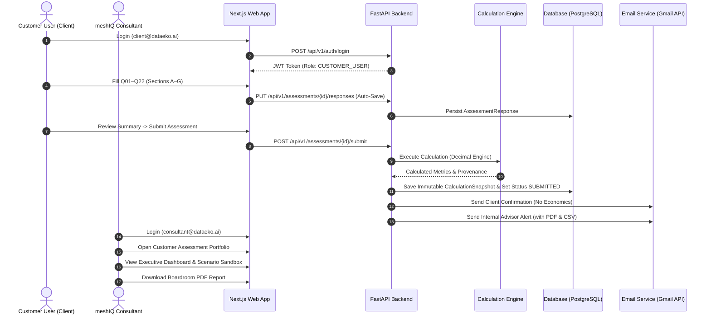

# 01. Project Overview & System Vision

> **Status**: IMPLEMENTED  
> **Authoritative Baseline**: `dev` @ `e2ee663` / `meshiq-handoff` @ `860ed5d`

---

## 1. System Identity & Relationship

The **DATAEKO × meshIQ Partner Dashboard** is an enterprise assessment and economic modeling application developed jointly by **DATAEKO.AI** and **meshIQ**. 

- **DATAEKO.AI**: AI and modern data advisory firm providing the economic calculation models, modern full-stack web architecture, governance infrastructure, and digital delivery platform.
- **meshIQ**: Enterprise middleware observability, management, and intelligence platform vendor whose commercial specialists and solutions architects use this platform to conduct economic discovery for enterprise IBM MQ customers.

---

## 2. Business Problem & Solution Vision

### The Problem
Historically, calculating the total economic cost, operational friction, and financial downtime exposure of legacy IBM MQ environments required unwieldy, unstandardized Excel spreadsheets. These spreadsheets suffered from:
1. Fragmented data entry and unverified customer facts.
2. Inconsistent formula execution and uncontrolled macro logic.
3. Lack of role-based data isolation (customers, consultants, and admins viewing raw unapproved math).
4. No immutable audit trail of how conclusions were derived.
5. Inability to deliver secure, boardroom-ready executive business cases cleanly.

### The Solution
The DATAEKO × meshIQ platform digitizes and standardizes this entire economic evaluation:
1. **Standardized Customer Intake**: 22 structured questions (Q01–Q22) categorized across 7 canonical thematic sections.
2. **Deterministic Calculation Engine**: An audited, pure Python `Decimal` calculation engine guaranteeing mathematical repeatability across 10/10 Golden Master scenarios.
3. **Immutable CalculationSnapshots**: When calculations execute, complete metric state, formula versions, and provenance classifications are permanently locked in the database.
4. **Role-Aware Workspaces**: Dedicated experiences for Clients (`CUSTOMER_USER`), Customer Admins (`CUSTOMER_ADMIN`), Consultants (`CONSULTANT`), Partner Admins (`PARTNER_ADMIN`), and Platform Admins (`PLATFORM_ADMIN`).
5. **Boardroom-Ready Deliverables**: Automated 3-page executive PDF generation and dual-branded email delivery workflows.
6. **Self-Contained Stakeholder Demo**: Standalone offline HTML export (`CLIENT_EXPERIENCE.html`) enabling executive review without server infrastructure.

---

## 3. High-Level User Workflows

---

## 4. Key Technology Stack Summary

| Layer | Primary Technology | Version | Purpose & Rationale |
| :--- | :--- | :--- | :--- |
| **Frontend Framework** | Next.js (App Router) | 16.3.6 | Server and client components, fast routing, zero-bundle production optimizations. |
| **Frontend UI Library** | React | 19.2.8 | Declarative component hierarchy, modern hooks, accessible modal and form bindings. |
| **Language (Frontend)** | TypeScript | 5.x | Strict compile-time typing across assessment states, API payloads, and component props. |
| **Styling** | Tailwind CSS | 4.x | Utility-first design tokens, responsive breakpoints, meshIQ dark/light palette. |
| **Icons** | Lucide React | 1.48.0 | Consistent vector icon system strictly bounded in size (`12px` to `20px`). |
| **Backend Framework** | FastAPI | 0.115+ | High-performance async REST API framework with automatic OpenAPI/Swagger generation. |
| **Language (Backend)** | Python | 3.11+ / 3.14 | Robust async ecosystem, standard typing, pure `Decimal` mathematical guarantees. |
| **ORM & Database Access**| SQLAlchemy (Async) | 2.0+ | Fully async database abstraction supporting SQLite (local dev) and PostgreSQL (production). |
| **Schema Migrations** | Alembic | 1.14+ | Version-controlled database migration management (Migrations 0001–0006). |
| **Data Validation** | Pydantic v2 | 2.10+ | Schema validation, request/response serialization, type coercion, and runtime validation. |
| **Security & Cryptography**| Passlib (Bcrypt) + PyJWT | 1.7+ / 2.10+ | Secure password hashing, HMAC-SHA256 JWT tokens with embedded `auth_version`. |
| **Automated Testing** | pytest + Vitest | 9.1+ / 5.0+ | 100% test coverage across calculations, Golden Masters, API security, and UI components. |
| **PDF Generation** | Playwright (Chromium) | 1.63+ | Automated headless browser rendering for high-fidelity 3-page executive PDF reports. |

---

## 5. Current Implementation Status vs. Future Boundaries

### Currently Implemented & Validated
- Full 22-question assessment intake with section navigation and progress calculation.
- Pure Python calculation engine implementing authoritative IBM MQ formulas.
- Immutable `CalculationSnapshot` persistence in JSONB columns.
- Executive Dashboard featuring 3-tier KPI hierarchy, Show the Math drawer, and Scenarios.
- 3-Page Executive PDF generation script (`frontend/scripts/render_report_pdf.mjs`).
- Dual email delivery (internal advisor notification with attachments; client confirmation with zero financial data).
- Five-tier RBAC with individual assessment ownership and customer tenant isolation.
- Offline, self-contained `CLIENT_EXPERIENCE.html` for stakeholder demonstration.

### Future / Planned Scope (Deferred)
- **Enterprise SSO / IdP**: SAML 2.0 / OIDC integrations with corporate identity providers (Okta, Azure AD).
- **Production Hosting**: Staging and production container deployment on Kubernetes / Cloud Run.
- **Website Integration**: Direct CTA links or optional iframe integration on `dataeko.ai/partners/meshiq`.
- **Advanced Scenario Comparison**: Multi-scenario goal-seeking and cross-portfolio benchmarking.

---
