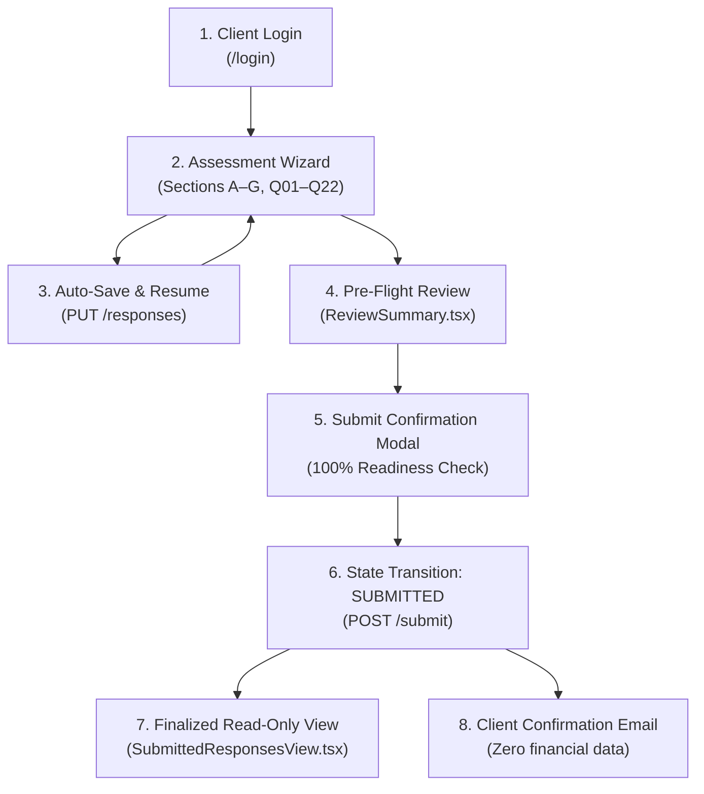

# 02. Customer & Client Experience Architecture

> **Status**: IMPLEMENTED  
> **Primary Components**: [`frontend/src/app/login/page.tsx`](file:///Users/roop/DATAEKO.AI-MESHIQ-partner_dashboard-/frontend/src/app/login/page.tsx), [`frontend/src/app/page.tsx`](file:///Users/roop/DATAEKO.AI-MESHIQ-partner_dashboard-/frontend/src/app/page.tsx), [`frontend/src/components/QuestionCard.tsx`](file:///Users/roop/DATAEKO.AI-MESHIQ-partner_dashboard-/frontend/src/components/QuestionCard.tsx), [`docs/handoff/CLIENT_EXPERIENCE.html`](file:///Users/roop/DATAEKO.AI-MESHIQ-partner_dashboard-/docs/handoff/CLIENT_EXPERIENCE.html)

---

## 1. Client Persona Overview

The **Client** (role: `CUSTOMER_USER`) is the enterprise customer stakeholder (e.g., Lead Middleware Engineer, Messaging Operations Director) who logs into the platform to complete an assessment of their organization's IBM MQ infrastructure.

### Client Experience Principles:
- **Zero Friction**: Clean, modern interface with immediate progress clarity.
- **Intake Integrity**: Every question presents approved dropdown responses with optional exact customer fact overrides.
- **Contextual Clarity**: Compact *Engine Impact* cards explain why each question matters.
- **Save & Resume**: Persistent draft state allowing the client to complete the 22 questions over multiple sessions.
- **Strict Privacy**: Clients see only their own organization's assessment draft; clients **never** see internal loaded labor rates, unapproved financial calculations, or cross-tenant data.

---

## 2. End-to-End Client Workflow

---

## 3. Screen-by-Screen Detailed Specification

### A. Login Experience (`/login`)
- **Visual Design**: Official centered meshIQ brand mark, subtle dark platform subtitle, and background concentric geometric contour arcs (`MeshIQLoginBackground.tsx`).
- **Form Controls**: Corporate email field, password field, "Forgot password?" affordance, and primary CTA button **"Continue as Demo Client →"**.
- **Presentation Access Card**: In development/demo mode, a designated card displays authorized 1-click access for `client@dataeko.ai`.
- **Security Invariant**: Authenticated sessions receive a signed HTTP-only JWT containing `user_id`, `tenant_id`, `customer_id`, `role: CUSTOMER_USER`, and `auth_version`.

### B. Assessment Wizard & Navigation (`WizardHeader.tsx`, `SectionNavigation.tsx`)
- **Wizard Header**:
  - Displays hierarchical tracker: `SECTION X OF 7 · Y OF 22 QUESTIONS ANSWERED`.
  - Gradient progress bar (`#008638` to `#8CC63E`) dynamically showing percentage completion.
  - Save status indicator: `✓ Draft initialized`, `Saving...`, `✓ Changes saved`, or `Unsaved changes`.
  - Manual `Save Progress` button.
- **Section Navigation Track**:
  - Horizontal scrolling tab bar containing all 7 canonical sections plus the `Review & Submit` step.
  - Distinct state badges on tabs: Complete (`Check` icon in green pill), In Progress (`CircleDot` icon in amber pill), and Inactive (`Section letter` in gray pill).
  - Smooth scroll controls (`ChevronLeft`, `ChevronRight`) for narrow viewport discoverability.

### C. The 7 Assessment Sections & Question Architecture

| Section ID & Title | Question Range | Focus Area & Themes | Primary Metric Impact |
| :--- | :--- | :--- | :--- |
| **A. Environment & Cost Baseline** | Q01–Q05 | Estate scale, staffing resources, operational model, quarterly administration hours (Q04), legacy technical debt. | Feeds Annual Admin Hours (`H_admin = Q04 × 4`) and Baseline Context. |
| **B. Troubleshooting Economics** | Q06–Q08 | Incident frequency (Q06), staff hours per investigation (Q07), diagnostic clock duration (Q08). | Feeds Annual Troubleshooting Events (`N_events`) and Investigation Hours (`H_inv`). |
| **C. Operational Complexity & Productivity** | Q09–Q11 | Monitoring tool count, manual tracing friction, primary operational productivity constraints. | Contextual qualifiers for observability and productivity friction. |
| **D. Business Consequence & Financial Exposure** | Q12–Q15 | Outage severity (Q12), recent disruption history, disruption duration (Q14), downtime cost override (Q15). | Feeds Downtime Rate (`R_impact`) and Single-Event Exposure (`Exposure = Q14 × R_impact`). |
| **E. Cost Reduction & Organizational Pressure** | Q16–Q17 | Executive OpEx reduction mandate, target percentage reduction. | Contextual qualifiers for modernization urgency. |
| **F. Cybersecurity & Remediation** | Q18–Q19 | Regulatory audit pressure, vulnerability patching friction. | Contextual qualifiers for security and compliance drag. |
| **G. Economic Inputs & Timing** | Q20–Q22 | Fully loaded annual labor rate override (Q20), customer annual MQ spend (Q21), transformation timeframe. | Feeds Loaded Hourly Rate (`R_hr = Q20 / 2080`) and isolated spend fact. |

### D. Question Card Structure (`QuestionCard.tsx`)
Each question card is implemented with strict visual hierarchy:
1. **Header**: Question code badge (`Q01`..`Q22`), bold question title, and thematic category tag.
2. **Question Text**: Clear, authoritative wording.
3. **Response Control**: Standardized single-select dropdown.
4. **Customer Fact Override**: Optional expandable input allowing exact numeric entry (e.g., exact QMs, exact staff, exact hours).
5. **Engine Impact Card**: Compact green banner (`[i] ENGINE IMPACT`) detailing how the response influences calculation formulas.
6. **Consultant Guidance**: Expandable accordion (`? Consultant Probing & Seller Guidance`) providing probing questions.

### E. Authoritative Q04 Implementation
- **Question**: *"Over a typical quarter, approximately how many total staff hours are spent on routine IBM MQ administration and management?"*
- **Unit**: `hours / quarter` (Exact numeric integer or decimal).
- **Semantics**: Captures routine operational maintenance excluding reactive troubleshooting.
- **Engine Translation**: Evaluated as `H_admin = Q04 × 4` (Annualized).
- **Unknown Handling**: Selecting *"Not sure / To be assessed"* evaluates to `INSUFFICIENT_DATA` without synthesizing midpoints.

### F. Pre-Flight Review & Submission (`ReviewSummary.tsx`)
- **Dark Hero Card**: Displays `22 / 22 Answered`, `0 Attention Needed`, `16 Standard Answers`, `6 Customer Facts`.
- **Section Audit Cards**: Accordion list showing all 22 questions, selected answers, and provenance pills (`Completed` vs `Customer Fact`).
- **Submit Modal**: Confirmation dialog requiring explicit verification before locking responses.
- **State Transition**: Dispatches `POST /api/v1/assessments/{id}/submit`, changing status to `SUBMITTED`.

### G. Finalized Read-Only Experience (`SubmittedResponsesView.tsx`)
- Displays green locked banner: `Assessment Submitted & Finalized` with `Read-Only Record` lock icon.
- Displays metadata: Customer Name, Submission Date, and Assessment Scope.
- All 22 questions are rendered as immutable, styled response pills. Subsequent `PUT` mutations are blocked with `HTTP 409 Conflict`.

---

## 4. Standalone Stakeholder Demo (`CLIENT_EXPERIENCE.html`)

For offline executive evaluation without running backend servers:
- **Location**: `docs/handoff/CLIENT_EXPERIENCE.html`
- **Architecture**: 100% self-contained HTML/CSS/JS with embedded base64 logos and zero external CDN requests.
- **Initial State**: Starts at clean 0% progress (`0 OF 22 QUESTIONS ANSWERED`).
- **Shortcuts**: User Menu (`client@dataeko.ai`) includes discreet shortcuts: `Pre-fill 22 Demo Responses`, `Reset to Clean Assessment`, `View Review Screen`, and `View Finalized View`.

---
