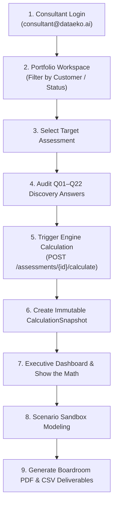

# 03. Consultant & Advisory Experience Architecture

> **Status**: IMPLEMENTED  
> **Primary Components**: [`frontend/src/components/ConsultantWorkspace.tsx`](file:///Users/roop/DATAEKO.AI-MESHIQ-partner_dashboard-/frontend/src/components/ConsultantWorkspace.tsx), [`frontend/src/components/ExecutiveDashboard.tsx`](file:///Users/roop/DATAEKO.AI-MESHIQ-partner_dashboard-/frontend/src/components/ExecutiveDashboard.tsx), [`frontend/src/components/ConsultantAssessmentSummary.tsx`](file:///Users/roop/DATAEKO.AI-MESHIQ-partner_dashboard-/frontend/src/components/ConsultantAssessmentSummary.tsx), [`frontend/src/components/ScenarioSandbox.tsx`](file:///Users/roop/DATAEKO.AI-MESHIQ-partner_dashboard-/frontend/src/components/ScenarioSandbox.tsx)

---

## 1. Consultant Persona Overview

The **Consultant** (role: `CONSULTANT`) is the meshIQ solutions architect or DATAEKO economic advisory specialist responsible for:
1. Managing the customer assessment portfolio within their authorized tenant.
2. Reviewing customer-submitted Q01–Q22 discovery responses.
3. Triggering deterministic calculation engine runs.
4. Analyzing operational labor breakdown, single-event exposure, and capacity drag on the Executive Dashboard.
5. Modeling controlled improvement scenarios in the Scenario Sandbox.
6. Exporting boardroom-ready 3-page executive PDF reports and CSV datasets for client leadership presentations.

---

## 2. Consultant Engagement Lifecycle

---

## 3. Detailed Consultant Capabilities

### A. Portfolio Workspace (`ConsultantWorkspace.tsx`)
- **Tenant Scope**: Automatically scoped to the consultant's active partner tenant (`tenant_id`). Cross-tenant assessments are strictly filtered out by the backend.
- **Search & Filters**: Real-time filtering by Customer Name, Assessment Title, and Status (`DRAFT`, `SUBMITTED`, `CALCULATED`, `ARCHIVED`).
- **Key Metrics Strip**:
  - Total Managed Assessments.
  - Active Drafts in Progress.
  - Submitted & Ready for Economic Modeling.
  - Completed Calculation Snapshots.
- **Customer Context Switcher**: Allows the consultant to switch focus between multiple authorized enterprise customer accounts.

### B. Economic Calculation Triggering (`api.ts` -> `POST /calculate`)
- Once discovery answers are reviewed, the consultant initiates calculation.
- Backend validates response inputs against `AssessmentInputs` schema.
- Executes `CalculationEngine.calculate(inputs)`.
- Persists new immutable `CalculationSnapshot` linked to the assessment.
- Transitions assessment status to `CALCULATED`.

### C. Executive Dashboard (`ExecutiveDashboard.tsx`)
The dashboard implements a structured 3-tier economic information hierarchy:

1. **Tier A — Primary Economic Headline**:
   - **Quantified Total Operational Labor Cost (`C_TOTAL`)**: Bold dollar headline accompanied by calculated Operational FTE Burden (`FTE`).
   - **Data Provenance**: Clearly tagged with `CALCULATED_RESULT` pill.
2. **Tier B — Operational Effort Decomposition**:
   - **Routine Administration (`C_ADMIN`)**: Annual hours (`H_admin = Q04 × 4`) and allocated labor cost.
   - **Incident Troubleshooting (`C_TRB`)**: Annual troubleshooting hours (`H_trb = N_events × H_inv`) and investigation labor cost.
   - **Single-Event Downtime Exposure (`Exposure`)**: Representative cost of a single major outage (`D_hours × R_impact`), isolated from annual totals.
   - **Customer-Reported MQ Spend (`Q21`)**: Standalone customer fact; never synthesized into operational labor.
3. **Tier C — Controlled meshIQ Improvement Scenario**:
   - Illustrative potential annual labor reclaim value.
   - Explicitly distinguished from baseline facts with bold safeguard notes (*not guaranteed cash savings or fixed ROI*).

### D. "Show the Math" Audit Drawer (`ShowTheMathDrawer.tsx`)
- Provides full mathematical transparency into how every dollar and hour was computed.
- Displays algebraic formulas:
  $$C_{	ext{TOTAL}} = C_{	ext{ADMIN}} + C_{	ext{TRB}}$$
  $$C_{	ext{ADMIN}} = (Q04 	imes 4) 	imes R_{	ext{hr}}$$
  $$C_{	ext{TRB}} = (N_{	ext{events}} 	imes H_{	ext{inv}}) 	imes R_{	ext{hr}}$$
- Shows exact numeric substitutions, engine version (`1.0.0`), rule set version (`calc-rules-v1.0.0`), and snapshot ID.

### E. Scenario Sandbox (`ScenarioSandbox.tsx`)
- Enables interactive sensitivity modeling without modifying baseline snapshot records:
  - **Routine Administration Efficiency**: Slider (default: 50% addressable share × 50% efficiency = 25% net reduction).
  - **Troubleshooting Effort Reduction**: Slider (default: 25% reduction in incident investigation hours).
  - **Incident Frequency Reduction**: Slider for preventive reliability gains.
- Dynamic recalculation updates recoverable staff hours and illustrative economic value in real-time.

### F. Deliverables & Boardroom Exports (`DeliverableService.py`, `render_report_pdf.mjs`)
- **3-Page Executive PDF Report**: Headless Playwright script compiles the approved boardroom report containing Cover/Executive Summary, Effort Decomposition & Show the Math, and Scenarios & Governance Safeguards.
- **CSV Data Export**: Generates raw tabular CSV dump of all 22 questions, computed metrics, and provenance tags for client enterprise reporting teams.

---

## 4. Consultant Permission Boundaries & Safeguards

| Action | Permitted? | Backend Enforcement |
| :--- | :---: | :--- |
| Create Assessment for Tenant Customer | **YES** | `Permission.ASSESSMENT_CREATE` |
| Edit Client Draft Responses | **YES** | `Permission.ASSESSMENT_UPDATE` (If status != `SUBMITTED`) |
| Trigger Calculation Engine | **YES** | `Permission.ASSESSMENT_CALCULATE` |
| View Calculation Snapshot & Math | **YES** | `Permission.SNAPSHOT_READ` |
| Generate Boardroom PDF / CSV | **YES** | `Permission.REPORT_GENERATE` |
| Access Cross-Tenant Customer Records | **NO** | Blocked by `tenant_id` database filter (`404 Not Found` / `403 Forbidden`) |
| Manage Platform System Settings | **NO** | Blocked by missing `Permission.TENANT_MANAGE` |

---
