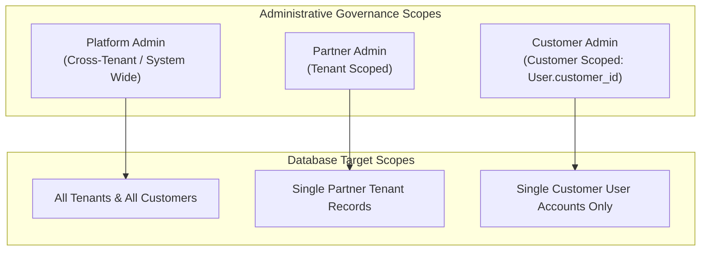

# 04. Administrator Experience & Governance Architecture

> **Status**: IMPLEMENTED  
> **Primary Components**: [`frontend/src/components/AdminWorkspace.tsx`](file:///Users/roop/DATAEKO.AI-MESHIQ-partner_dashboard-/frontend/src/components/AdminWorkspace.tsx), [`backend/app/api/v1/users.py`](file:///Users/roop/DATAEKO.AI-MESHIQ-partner_dashboard-/backend/app/api/v1/users.py), [`backend/app/api/v1/customers.py`](file:///Users/roop/DATAEKO.AI-MESHIQ-partner_dashboard-/backend/app/api/v1/customers.py), [`backend/app/core/rbac.py`](file:///Users/roop/DATAEKO.AI-MESHIQ-partner_dashboard-/backend/app/core/rbac.py)

---

## 1. Administrator Personas

The platform defines three administrative tiers with distinct governance boundaries:

1. **Platform Administrator (`PLATFORM_ADMIN`)**: Global system superuser (e.g., `admin@dataeko.ai`). Manages all tenants, customer organizations, users, and audit logs across the entire system.
2. **Partner Administrator (`PARTNER_ADMIN`)**: Partner tenant administrator (e.g., `partner@dataeko.ai`). Manages customer entities, consultants, and customer accounts strictly within their assigned partner tenant.
3. **Customer Administrator (`CUSTOMER_ADMIN`)**: Enterprise customer administrator (e.g., `customer_admin@dataeko.ai`). Manages client user accounts within their single designated customer organization (`User.customer_id`).

---

## 2. Definitive RBAC Permission Matrix

The following matrix documents the authoritative server-side permissions configured in `backend/app/core/rbac.py`:

| Permission String | Description | PLATFORM_ADMIN | PARTNER_ADMIN | CONSULTANT | CUSTOMER_ADMIN | CUSTOMER_USER |
| :--- | :--- | :---: | :---: | :---: | :---: | :---: |
| `customer:create` | Provision new customer organization | **YES** | **YES** | **YES** | NO | NO |
| `customer:read` | View customer organization details | **YES** | **YES** | **YES** | **YES** | **YES** |
| `customer:update` | Edit customer organization metadata | **YES** | **YES** | **YES** | **YES** | NO |
| `assessment:create` | Initialize new assessment draft | **YES** | **YES** | **YES** | **YES** | **YES** |
| `assessment:read` | Read assessment data & questions | **YES** | **YES** | **YES** | **YES** | **YES** (Owned only) |
| `assessment:update` | Mutate assessment responses | **YES** | **YES** | **YES** | **YES** | **YES** (Owned only) |
| `assessment:calculate`| Trigger calculation engine run | **YES** | **YES** | **YES** | **YES** | NO |
| `snapshot:read` | View CalculationSnapshot & Math | **YES** | **YES** | **YES** | **YES** | NO |
| `report:generate` | Generate executive PDF & CSV | **YES** | **YES** | **YES** | **YES** | NO |
| `audit:read` | Inspect system audit event logs | **YES** | **YES** | **YES** | NO | NO |
| `tenant:manage` | Manage tenant & user governance | **YES** | **YES** | NO | **YES** (Scoped) | NO |

---

## 3. Administrative Workspaces & Capabilities

### A. Administration & Governance Workspace (`AdminWorkspace.tsx`)
- **Visual Design**: Clean, light lavender-tinted hero banner (`bg-gradient-to-br from-[#FAF7FD] via-[#F6F1FA] to-[#F1EBF7] border border-[#E5D7F2]`) with governance purple badge `PLATFORM ADMINISTRATION`.
- **System Scope Card**: Elevated white card displaying `GLOBAL SYSTEM / CROSS-TENANT SCOPE` or active partner tenant.
- **Three Governance Registries**:
  1. **Customer Directory**: Complete listing of all provisioned enterprise customer organizations with region, industry, active assessment counts, and status toggles.
  2. **Assessment Registry**: Global audit registry of all assessments across all states (`DRAFT`, `SUBMITTED`, `CALCULATED`, `ARCHIVED`).
  3. **User Governance Directory**: Centralized user management table displaying Name, Email, Assigned Customer, Role, Active Status, and Credential Actions.

### B. Customer Provisioning Lifecycle (`POST /api/v1/customers`)
- Platform and Partner Admins provision customer accounts specifying:
  - Organization Name (e.g., *"Apex Global Financial"*).
  - Primary Industry (e.g., *"Financial Services & Banking"*).
  - Operational Region (e.g., *"North America"*).
- Backend automatically assigns `tenant_id` and provisions isolated database records.

### C. Secure User Invitation Lifecycle (`POST /api/v1/users/invite`)
- Admins invite new users by specifying Email, Full Name, Role, and Customer ID.
- **Cryptographic Token Generation**: Generates high-entropy random URL-safe token.
- **SHA-256 Storage**: Only the SHA-256 hash of the token is stored in the database (`UserCredentialToken.token_hash`); raw tokens are never persisted.
- **Expiration & Single-Use**: Tokens expire after 72 hours and are atomically invalidated upon use (`used_at` timestamp).
- **Acceptance Flow**: Invitee follows link to `/accept-invitation?token=...`, sets their password, and activates their account.

### D. Credential Resets & Instant Session Invalidation (`POST /api/v1/users/forgot-password`)
- Secure token-based password reset workflow with rate limiting.
- **Per-User Session Versioning (`auth_version`)**:
  - When an admin resets credentials or a user changes their password, `User.auth_version` is atomically incremented by 1.
  - Because active JWT tokens carry the previous `auth_version`, all existing client sessions are instantly revoked across all devices without needing Redis.

### E. User Activation & Deactivation (`PUT /api/v1/users/{id}`)
- Admins can toggle `User.is_active` to `False`.
- Inactive users are immediately rejected by FastAPI dependency `get_current_active_user` with `HTTP 403 Forbidden`.

---

## 4. Administrative Security Boundaries

---
