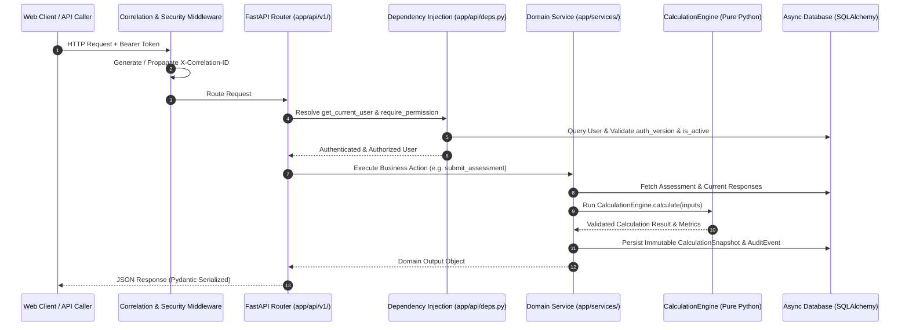

# 06. Backend Architecture & Service Layer

> **Status**: IMPLEMENTED  
> **Source Directory**: [`backend/app/`](file:///Users/roop/DATAEKO.AI-MESHIQ-partner_dashboard-/backend/app/)

---

## 1. Backend Architecture & Design Philosophy

The backend is built with **FastAPI** on **Python 3.11+ / 3.14**, utilizing an asynchronous, layered architecture designed for strict tenant isolation, auditable data persistence, deterministic calculation execution, and high-throughput async I/O.

### Architectural Principles:
1. **Layered Separation of Concerns**:
   - **Router / API Layer (`app/api/v1/`)**: HTTP routing, parameter deserialization, and HTTP exception translation.
   - **Dependency Injection Layer (`app/api/deps.py`)**: Authentication token decoding, session version verification, and permission validation.
   - **Service Layer (`app/services/`)**: Business orchestration, state transitions, email triggers, and artifact coordination.
   - **Calculation Engine (`app/calculation_engine/`)**: Pure, isolated, zero-database financial and effort math utilizing pure Decimal arithmetic.
   - **Data Access Layer (`app/models/`)**: SQLAlchemy 2.0 Async ORM models mapped to PostgreSQL / SQLite.
2. **Deterministic & Stateless Engine**: The calculation engine has zero database or network dependencies. It accepts an immutable `AssessmentInputs` value object and returns calculated metrics.
3. **Correlation & Observability**: Every request is tagged with a unique `X-Correlation-ID` header, propagated through logging context and audit events.

---

## 2. Request Lifecycle & Execution Pipeline



---

## 3. Core Directory & Module Inventory

```text
backend/app/
├── main.py                          # FastAPI application initialization & middleware stack
├── config.py                        # Pydantic Settings (Environment variables & defaults)
├── api/
│   ├── deps.py                      # FastAPI dependencies (get_db, get_current_user, RBAC guards)
│   └── v1/
│       ├── api.py                   # Central API v1 router aggregator
│       ├── auth.py                  # Login, token refresh, logout, current user profile
│       ├── assessments.py           # Assessment CRUD, responses, calculation, submission, deliverables
│       ├── customers.py             # Customer organization management & scoping
│       ├── users.py                 # User creation, invitations, password resets, activation
│       ├── audit.py                 # Structured audit event query endpoints
│       ├── health.py                # Liveness (/health/live) and Readiness (/health/ready) probes
│       └── admin_email.py           # Test email endpoint for platform administrators
├── calculation_engine/              # Deterministic IBM MQ Economic Calculation Engine
│   ├── engine.py                    # CalculationEngine core class and execution flow
│   ├── models.py                    # Pydantic inputs, metrics, and summary data structures
│   ├── constants.py                 # Authoritative economic constants and multipliers
│   ├── lookups.py                   # Frequency, investigation hour, and duration lookup tables
│   └── enums.py                     # CalculationState and DataProvenanceTier enums
├── core/
│   ├── database.py                  # Async SQLAlchemy engine, session maker, base model
│   ├── security.py                  # Password hashing (Bcrypt), JWT creation & verification
│   ├── rbac.py                      # Canonical Roles, Permissions, and permission checks
│   ├── correlation.py               # Request correlation ID tracking and contextvars
│   ├── logging.py                   # Structured JSON logging configuration
│   ├── middleware.py                # Global error handling, correlation headers, security headers
│   ├── rate_limit.py                # In-memory token bucket rate limiter for auth endpoints
│   ├── audit.py                     # Central audit logging recording helpers
│   └── errors.py                    # Structured domain exception definitions
├── models/                          # SQLAlchemy ORM Database Models
│   ├── base.py                      # Declarative Base with created_at / updated_at mixins
│   ├── tenant.py                    # Partner Tenant model
│   ├── customer.py                  # Customer Organization model
│   ├── user.py                      # User model with auth_version and customer_id
│   ├── user_credential_token.py     # Token hash model for invitations and password resets
│   ├── assessment.py                # Assessment entity and status lifecycle
│   ├── assessment_response.py       # Discovery response persistence and raw_responses JSON
│   ├── calculation_snapshot.py      # Immutable calculation results snapshot
│   └── audit_event.py               # Structured compliance audit event records
├── schemas/                         # Pydantic Request/Response Validation Schemas
└── services/                        # Domain Business Logic Services
    ├── assessment_service.py        # Assessment creation, scoping, and state orchestration
    ├── calculation_service.py       # Engine execution, input extraction, snapshot storage
    ├── customer_service.py          # Customer provisioning and tenant scoping
    ├── credential_service.py        # Cryptographic tokens, invitations, password resets
    ├── deliverable_service.py       # Executive PDF and CSV deliverable compilation
    └── email_service.py             # Gmail REST API OAuth 2.0 dual-email delivery
```

---

## 4. Key Middleware & Infrastructure Services

1. **Correlation Middleware (`app/core/correlation.py`)**:
   - Ingests incoming `X-Correlation-ID` header or generates a fresh UUID4.
   - Binds correlation ID to `contextvars` context; automatically attaches it to all log records, outgoing response headers, and audit events.
2. **Global Error Handling Middleware (`app/core/middleware.py`)**:
   - Catches unhandled exceptions, logs structured error traces with correlation ID, and returns sanitized JSON responses (`500 Internal Server Error`) preventing internal stack trace leakage.
3. **Rate Limiting (`app/core/rate_limit.py`)**:
   - Enforces IP and account-level rate limits on sensitive endpoints (`/auth/login`, `/users/forgot-password`) returning `HTTP 429 Too Many Requests`.

---
