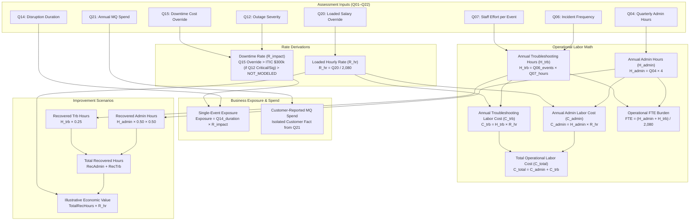

# 08. Deterministic Calculation Engine & Business Logic

> **Status**: IMPLEMENTED & 100% FROZEN (PROTECTED)  
> **Source Directory**: [`backend/app/calculation_engine/`](file:///Users/roop/DATAEKO.AI-MESHIQ-partner_dashboard-/backend/app/calculation_engine/)

---

## 1. Engine Architecture & Mathematical Principles

The **CalculationEngine** is a pure, deterministic Python calculation module.

### Core Mathematical Rules:
1. **Pure Decimal Arithmetic**: All financial calculations, labor hours, rates, and multipliers use Python's standard `Decimal` module. Float arithmetic is strictly prohibited to eliminate binary floating-point inaccuracies.
2. **Standard Financial Rounding**: Results are rounded using `ROUND_HALF_UP` to two decimal places for currency and hours, and four decimal places for intermediate rate division.
3. **6-Tier Data Provenance Classification**: Every input and output metric is tagged with an authoritative provenance tier:
   - `CUSTOMER_FACT`: Entered directly by customer (e.g., Q04 hours, Q15 rate override, Q21 spend).
   - `MODEL_ASSUMPTION`: Baseline model constants (e.g., 2,080 working hours/year).
   - `INDUSTRY_BENCHMARK`: External reference standards (e.g., ITIC $300,000/hr critical downtime benchmark).
   - `CALCULATED_RESULT`: Derived mathematically from customer facts and formulas.
   - `ILLUSTRATIVE_SCENARIO`: Model-projected future state (e.g., 25% troubleshooting reduction).
   - `DEMO_VALUE`: Representative demonstration data.

---

## 2. Authoritative Constants & Multipliers

Defined in `backend/app/calculation_engine/constants.py`:

| Constant Identifier | Value | Type | Description |
| :--- | :--- | :--- | :--- |
| `ANNUAL_WORKING_HOURS` | `2080` | `Decimal` | Standard working hours per FTE per year (52 weeks × 40 hours/week). |
| `QUARTERS_PER_YEAR` | `4` | `Decimal` | Annualization multiplier for quarterly administration hours (Q04). |
| `DEFAULT_ANNUAL_LOADED_LABOR_COST` | `180000` | `Decimal` | Default baseline loaded annual salary per MQ engineer ($/year). |
| `ITIC_DOWNTIME_BENCHMARK_HOURLY` | `300000` | `Decimal` | ITIC benchmark hourly downtime cost for critical outages ($/hour). |
| `SCENARIO_ADMIN_ADDRESSABLE_SHARE` | `0.50` | `Decimal` | 50% share of routine administration addressable by automation. |
| `SCENARIO_ADMIN_EFFICIENCY_IMPROVEMENT` | `0.50` | `Decimal` | 50% efficiency capture on addressable admin tasks. |
| `SCENARIO_INVESTIGATION_IMPROVEMENT` | `0.25` | `Decimal` | 25% reduction in incident investigation effort. |
| `SCENARIO_TROUBLESHOOTING_OPPORTUNITY_SHARE`| `0.10` | `Decimal` | 10% conservative troubleshooting productivity opportunity. |
| `ENGINE_VERSION` | `"1.0.0"` | `str` | Authoritative calculation engine version identifier. |
| `RULE_SET_VERSION` | `"calc-rules-v1.0.0"` | `str` | Authoritative calculation ruleset version identifier. |

---

## 3. Authoritative Formulas & Derivation Pipeline

---

## 4. Detailed Metric Derivations

### A. Loaded Hourly Labor Rate ($R_{	ext{hr}}$)
$$R_{	ext{hr}} = rac{Q20_{	ext{salary}}}{2080}$$
- If Q20 is unspecified or default, applies `$180,000 / 2080 = $86.5385/hr` (`MODEL_ASSUMPTION`).
- If custom salary entered (e.g., `$250,000`), evaluates `$250,000 / 2080 = $120.1923/hr` (`CUSTOMER_FACT`).

### B. Annual Administration Hours ($H_{	ext{admin}}$) & Cost ($C_{	ext{admin}}$)
$$H_{	ext{admin}} = Q04_{	ext{quarterly\_hours}} 	imes 4$$
$$C_{	ext{admin}} = H_{	ext{admin}} 	imes R_{	ext{hr}}$$

### C. Annual Troubleshooting Events ($N_{	ext{events}}$), Hours ($H_{	ext{trb}}$) & Cost ($C_{	ext{trb}}$)
- $N_{	ext{events}}$ mapped via lookup table from Q06 (e.g., `"Multiple times per week"` = 104 events/year; `"About weekly"` = 52 events/year).
- $H_{	ext{inv}}$ mapped from Q07 (e.g., `"6–10 hours"` = 8.0 hrs/event; or exact numeric override).
$$H_{	ext{trb}} = N_{	ext{events}} 	imes H_{	ext{inv}}$$
$$C_{	ext{trb}} = H_{	ext{trb}} 	imes R_{	ext{hr}}$$

### D. Total Quantified Operational Labor Cost ($C_{	ext{total}}$) & FTE Burden
$$C_{	ext{total}} = C_{	ext{admin}} + C_{	ext{trb}}$$
$$	ext{FTE Burden} = rac{H_{	ext{admin}} + H_{	ext{trb}}}{2080}$$

### E. Single-Event Downtime Exposure ($	ext{Exposure}$)
- $D_{	ext{hours}}$ mapped from Q14 disruption duration (e.g., `"11–45 minutes"` = 0.467 hrs; `">8 hours"` = 10.0 hrs).
- $R_{	ext{impact}}$ evaluated via 3-tier hierarchy:
  1. Customer Override (Q15 numeric input) -> Priority 1 (`CUSTOMER_FACT`).
  2. ITIC Benchmark (`$300,000/hr`) if Q12 is `"Critical"` or `"Significant"` -> Priority 2 (`INDUSTRY_BENCHMARK`).
  3. `NOT_MODELED` if Q12 is Moderate/Minor/Unknown and Q15 is unprovided.
$$	ext{Exposure} = D_{	ext{hours}} 	imes R_{	ext{impact}}$$
*(Note: Explicitly marked as non-annualized; never multiplied by annual event counts).*

### F. Illustrative meshIQ Improvement Scenario
$$	ext{Recovered Admin Hours} = H_{	ext{admin}} 	imes 0.50 	imes 0.50 = H_{	ext{admin}} 	imes 0.25$$
$$	ext{Recovered Troubleshooting Hours} = H_{	ext{trb}} 	imes 0.25$$
$$	ext{Total Recovered Hours} = 	ext{Recovered Admin Hours} + 	ext{Recovered Troubleshooting Hours}$$
$$	ext{Illustrative Economic Value} = 	ext{Total Recovered Hours} 	imes R_{	ext{hr}}$$

---

## 5. Golden Master Verification Baseline (10/10 PASS)

The calculation engine is verified against 10 reference scenarios in `backend/tests/calculation_engine/test_golden_masters.py`:

| Test Case | Scenario Description | Expected $C_{	ext{total}}$ | Expected FTE | Expected Exposure | Expected Scenario Value |
| :--- | :--- | :--- | :--- | :--- | :--- |
| **TC-01** | Baseline Mid-Market Standard | `$36,000.00` | 0.20 | `$16,700.00` | `$9,000.00` |
| **TC-02** | Large Enterprise High-Volume | `$498,461.54` | 2.77 | `$3,000,000.00` | `$124,615.38` |
| **TC-03** | Financial Hyper-Scale Critical | `$784,855.77` | 3.14 | `$3,500,000.00` | `$196,213.94` |
| **TC-04** | Small Business / Low Friction | `$3,461.54` | 0.02 | `$0.00` | `$865.38` |
| **TC-05** | Custom Loaded Salary Override | `$51,000.00` | 0.20 | `$23,640.20` | `$12,750.00` |
| **TC-06** | Custom Hourly Downtime Rate | `$36,000.00` | 0.20 | `$27,820.00` | `$9,000.00` |
| **TC-07** | Zero Incidents / Low Admin | `$1,384.62` | 0.01 | `$0.00` | `$346.15` |
| **TC-08** | Incomplete Discovery Inputs | `INSUFFICIENT`| `INSUFFICIENT`| `INSUFFICIENT`| `INSUFFICIENT`|
| **TC-09** | Extreme Outlier Defense | `$8,307,692.31`| 46.15 | `$30,000,000.00`| `$2,076,923.08` |
| **TC-10** | Minimal Admin with High Events | `$43,269.23` | 0.24 | `$140,100.00` | `$10,817.31` |

---
