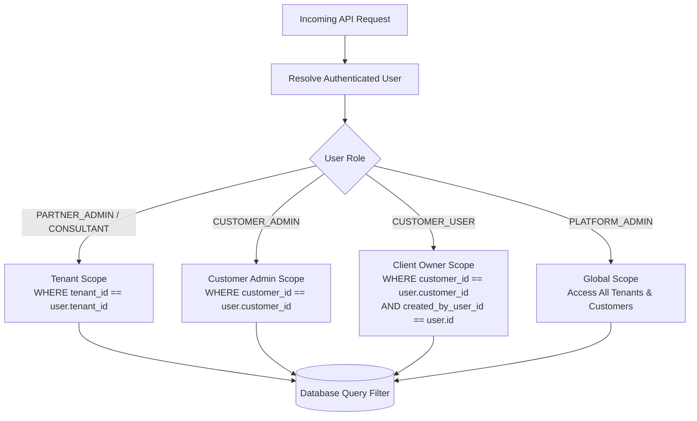

# 09. Security, RBAC & Tenant Isolation Architecture

> **Status**: IMPLEMENTED & AUDITED  
> **Source Directory**: [`backend/app/core/`](file:///Users/roop/DATAEKO.AI-MESHIQ-partner_dashboard-/backend/app/core/), [`backend/tests/security/`](file:///Users/roop/DATAEKO.AI-MESHIQ-partner_dashboard-/backend/tests/security/)

---

## 1. Authentication Architecture & Token Lifecycle

### A. JWT Authentication Mechanism
- **Algorithm**: HMAC-SHA256 (`HS256`).
- **Signing Secret**: `SECRET_KEY` loaded from environment (enforces minimum 32-character high entropy in production).
- **Token Claims**:
  - `sub`: User ID (UUID).
  - `tenant_id`: Partner Tenant ID (UUID).
  - `customer_id`: Assigned Customer ID (UUID, nullable).
  - `role`: Role string (e.g. `CUSTOMER_USER`, `CONSULTANT`).
  - `auth_version`: Session version integer counter.
  - `exp`: Expiration timestamp (default: 60 minutes for access token).

### B. Session Versioning (`auth_version`) & Instant Invalidation
- Eliminates the need for external session stores (Redis) while providing instant token revocation.
- Every `User` record has an `auth_version: int` column (default: 1).
- Upon password reset, credential modification, or admin deactivation, `User.auth_version` is incremented.
- The `get_current_user` dependency compares `token.auth_version == user.auth_version`. If mismatched, it immediately rejects the request with `HTTP 401 Unauthorized` (`"Token has been revoked"`).

---

## 2. Multi-Tenant & Customer Isolation Boundaries

### Isolation Rules Enforced in Service Layer:
1. **Tenant Isolation**: Every database query for customers, assessments, and snapshots automatically appends `WHERE tenant_id == user.tenant_id` for non-platform admins.
2. **Customer Isolation**: `CUSTOMER_ADMIN` users can only read/manage records where `customer_id == user.customer_id`.
3. **Individual Client Ownership (Batch 4C)**: `CUSTOMER_USER` accounts can only access assessments where `created_by_user_id == user.id`. Cross-user assessment access within the same customer returns `HTTP 404 Not Found`.

---

## 3. IDOR & Parameter Tampering Defenses

1. **UUID Primary Keys**: All entity IDs are high-entropy UUIDv4 strings, preventing sequential enumeration attacks.
2. **Payload Sanitization**: `tenant_id` and `customer_id` parameters passed in request bodies are ignored or overwritten by the server using the verified claims from the JWT.
3. **Assessment Mutation Guard**: Responses can only be mutated while status is `DRAFT`. Attempts to edit `SUBMITTED` assessments return `HTTP 409 Conflict`.

---

## 4. Credential & Invitation Token Security

1. **Password Hashing**: Passwords are cryptographically hashed using **Bcrypt** with salt (`passlib.context.CryptContext(schemes=["bcrypt"])`).
2. **Invitation & Reset Tokens**:
   - High-entropy tokens generated using Python's `secrets.token_urlsafe(32)`.
   - Raw tokens are sent only to the recipient's email address.
   - **Database Storage**: The database stores **only** the SHA-256 hash (`token_hash = hashlib.sha256(raw_token.encode()).hexdigest()`). Even if the database is leaked, raw tokens cannot be recovered.
   - **Replay Protection**: Tokens are marked with `used_at` timestamp upon consumption and rejected on replay attempts.

---

## 5. Security Audit Findings & Status Matrix

| Category | Control / Finding | Classification | Status | Verification Reference |
| :--- | :--- | :---: | :---: | :--- |
| **Authentication** | Mandatory auth dependency on all assessment routes | Confirmed | **IMPLEMENTED** | `backend/tests/security/test_authentication.py` |
| **Session Control** | Instant JWT invalidation via `auth_version` | Confirmed | **IMPLEMENTED** | `backend/tests/security/test_session_invalidation_and_auth_version.py` |
| **Tenant Boundary** | Scoped SQL filters on tenant and customer IDs | Confirmed | **IMPLEMENTED** | `backend/tests/security/test_tenant_isolation_and_idor.py` |
| **IDOR Protection**| Individual client assessment ownership check | Confirmed | **IMPLEMENTED** | `backend/tests/security/test_client_rbac_and_ownership.py` |
| **Rate Limiting** | In-memory token bucket on `/auth/login` | Confirmed | **IMPLEMENTED** | `backend/tests/security/test_rate_limiting.py` |
| **Password Storage**| Salted Bcrypt hashing | Confirmed | **IMPLEMENTED** | `backend/app/core/security.py` |
| **Token Storage** | SHA-256 token hashing for invites/resets | Confirmed | **IMPLEMENTED** | `backend/tests/security/test_invitation_and_credential_lifecycle.py` |
| **Immutability** | `HTTP 409 Conflict` on submitted mutations | Confirmed | **IMPLEMENTED** | `backend/tests/security/test_snapshot_immutability.py` |
| **Production Secrets**| Zero hardcoded secrets in repository | Confirmed | **VERIFIED** | Clean git history & `.gitignore` enforcement |
| **Enterprise SSO** | SAML 2.0 / OIDC Identity Provider integration | Roadmap | **FUTURE / PLANNED** | Deferred to enterprise deployment phase |
| **Distributed Rate Limit**| Redis-backed rate limiter for clustered setups | Roadmap | **FUTURE / PLANNED** | In-memory limiter active for single instance |

---
