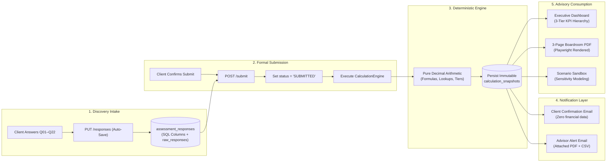

# 10. API Specification & End-to-End Data Flow

> **Status**: IMPLEMENTED  
> **Base URL**: `http://127.0.0.1:8000/api/v1`  
> **Interactive Docs**: `http://127.0.0.1:8000/docs`

---

## 1. REST API Endpoint Catalog

### Authentication Router (`/api/v1/auth`)
| Method | Endpoint | Description | Auth Required | Role Scope |
| :--- | :--- | :--- | :---: | :--- |
| `POST` | `/auth/login` | Authenticate with email/password; returns JWT | NO | Public (Rate Limited) |
| `POST` | `/auth/refresh` | Refresh access token using active session | YES | Any active user |
| `POST` | `/auth/logout` | Client-side logout token invalidation | YES | Any active user |
| `GET` | `/auth/me` | Fetch authenticated user profile & permissions | YES | Any active user |

### Assessments Router (`/api/v1/assessments`)
| Method | Endpoint | Description | Auth Required | Permissions Enforced |
| :--- | :--- | :--- | :---: | :--- |
| `GET` | `/assessments` | List accessible assessments | YES | `assessment:read` |
| `POST` | `/assessments` | Create new assessment draft | YES | `assessment:create` |
| `GET` | `/assessments/{id}` | Get assessment metadata & responses | YES | `assessment:read` |
| `PUT` | `/assessments/{id}` | Update assessment title/status | YES | `assessment:update` |
| `PUT` | `/assessments/{id}/responses`| Save discovery responses (Auto-Save) | YES | `assessment:update` (DRAFT only) |
| `POST` | `/assessments/{id}/calculate`| Trigger deterministic calculation engine | YES | `assessment:calculate` |
| `GET` | `/assessments/{id}/snapshots`| List historical calculation snapshots | YES | `snapshot:read` |
| `GET` | `/assessments/{id}/snapshots/latest`| Get latest immutable calculation snapshot | YES | `snapshot:read` |
| `POST` | `/assessments/{id}/submit` | Submit assessment, lock, trigger emails | YES | `assessment:update` |
| `GET` | `/assessments/{id}/deliverables/pdf`| Download 3-page executive PDF report | YES | `report:generate` |
| `GET` | `/assessments/{id}/deliverables/csv`| Download assessment CSV export | YES | `report:generate` |

### Customers Router (`/api/v1/customers`)
| Method | Endpoint | Description | Auth Required | Permissions Enforced |
| :--- | :--- | :--- | :---: | :--- |
| `GET` | `/customers` | List customer organizations in scope | YES | `customer:read` |
| `POST` | `/customers` | Provision new customer organization | YES | `customer:create` |
| `GET` | `/customers/{id}` | Get customer details & assessment count | YES | `customer:read` |
| `PUT` | `/customers/{id}` | Update customer organization metadata | YES | `customer:update` |

### Users & Credential Router (`/api/v1/users`)
| Method | Endpoint | Description | Auth Required | Permissions Enforced |
| :--- | :--- | :--- | :---: | :--- |
| `GET` | `/users` | List users within authorized scope | YES | `tenant:manage` |
| `POST` | `/users` | Directly create user (Admin only) | YES | `tenant:manage` |
| `GET` | `/users/{id}` | Get user record by ID | YES | `tenant:manage` |
| `PUT` | `/users/{id}` | Update user (name, role, is_active) | YES | `tenant:manage` |
| `POST` | `/users/invite` | Issue invitation token to new user | YES | `tenant:manage` |
| `POST` | `/users/accept-invitation` | Set password & accept invitation token | NO | Token Verification |
| `POST` | `/users/forgot-password` | Request password reset token email | NO | Rate Limited |
| `POST` | `/users/reset-password` | Execute password reset using token | NO | Token Verification |

### Audit & Health Routers (`/api/v1/audit`, `/api/v1/health`)
| Method | Endpoint | Description | Auth Required | Permissions Enforced |
| :--- | :--- | :--- | :---: | :--- |
| `GET` | `/audit` | Query structured audit event stream | YES | `audit:read` |
| `GET` | `/health/live` | Application liveness probe | NO | Public |
| `GET` | `/health/ready`| Database connectivity readiness probe | NO | Public |

---

## 2. End-to-End Data Flow: Discovery to Executive Report

---
