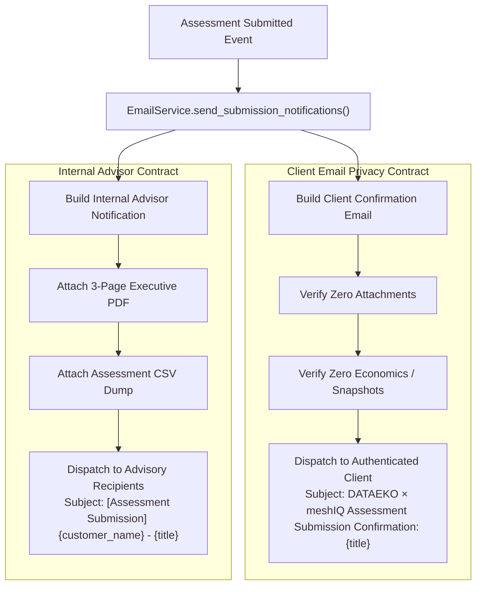

# 11. Reporting, PDF Generation & Email Service Architecture

> **Status**: IMPLEMENTED  
> **Source Directory**: [`backend/app/services/`](file:///Users/roop/DATAEKO.AI-MESHIQ-partner_dashboard-/backend/app/services/), [`frontend/scripts/`](file:///Users/roop/DATAEKO.AI-MESHIQ-partner_dashboard-/frontend/scripts/)

---

## 1. Executive PDF Report Deliverable

The boardroom-ready 3-page executive PDF report is compiled via **Playwright Headless Chromium** (`frontend/scripts/render_report_pdf.mjs`).

### Architectural Invariants:
1. **Strict Presentation-Only**: The PDF generator reads authoritative values strictly from `CalculationSnapshot.computed_metrics` and `summary_metrics`. It **never** recalculates math, averages, or proportions.
2. **Fixed 3-Page Structure**:
   - **Page 1: Cover & Executive Summary**: meshIQ logo, dark navy hero banner, metadata strip, 4 primary KPI cards (Quantified Operational Labor, Single-Event Exposure, Customer-Reported MQ Spend, Illustrative Economic Value), executive economic synthesis, and provenance guidance.
   - **Page 2: Effort Decomposition & Business Exposure**: Neutral workload decomposition table (Routine Administration vs Incident Troubleshooting), Show the Math formula container ($C_{	ext{TOTAL}} = C_{	ext{ADMIN}} + C_{	ext{TRB}}$), and single-event exposure cards.
   - **Page 3: Scenarios, Governance & Architect CTA**: Troubleshooting productivity opportunity (10%), meshIQ improvement scenario, 5-tier provenance matrix, governance safeguards, and contact CTA.
3. **Zero Synthetic Numbers**: If discovery data is incomplete, the PDF renders authoritative `—` placeholders and explanatory notes; it never synthesizes midpoint values.

---

## 2. Dual-Email Delivery Architecture (`EmailService.py`)

Email delivery is powered by the **Google Gmail REST API** using OAuth 2.0 (`https://www.googleapis.com/auth/gmail.send`).

### Strict Client Privacy Invariants:
- **Zero Attachments**: Client emails have `attachments = []`.
- **Zero Financial Data**: Contains no `CalculationSnapshot`, no dollar figures, no loaded labor rates, and no internal recipient addresses.
- **Data Scope**: Displays strictly the customer's submitted Q01–Q22 answers for record-keeping.

---

## 3. CSV Dataset Export Architecture

- Generated on-demand via `GET /api/v1/assessments/{id}/deliverables/csv`.
- Output columns include: Question Code, Title, Category Theme, Selected Response, Exact Override Value, Calculation Feeder Flag, Formula Impact Note, and Provenance Tier.

---
