# 12. Testing and Quality Assurance Architecture

> **Authoritative Scope**: Test suites, test categories, Golden Master methodology, coverage baselines, automated regression protections, quality gates.  
> **Status**: IMPLEMENTED / VERIFIED

---

## 1. Executive Summary & Philosophy

The **DATAEKO × meshIQ** platform maintains an exceptionally rigorous testing architecture designed to prevent silent regression of protected business logic, mathematical formulas, tenant isolation boundaries, and security policies.

```mermaid
flowchart TD
    subgraph "Backend Quality Gates (pytest)"
        GM["Golden Master Suite (10/10)"]
        Unit["Calculation Engine Unit Tests"]
        Auth["RBAC & Tenant Scoping Tests"]
        API["API Integration & Endpoint Tests"]
        Snap["Snapshot & Provenance Tests"]
    end
    
    subgraph "Frontend Quality Gates (Vitest)"
        Comp["Component Unit Tests (226 passing)"]
        CalcUI["'Show the Math' Verification"]
        RoleUI["Role Workspaces & Routing"]
        Wiz["Wizard & Q04 Input Logic"]
        Prov["Report Provenance Hardening"]
    end
    
    subgraph "Static Analysis & Type Safety"
        TS["TypeScript Strict Mode (tsc)"]
        Pyd["Pydantic v2 Strict Validation"]
        Linter["Linting & Syntax Rules"]
    end
    
    GM --> PASS["Production Readiness Gate"]
    Unit --> PASS
    Auth --> PASS
    Comp --> PASS
    CalcUI --> PASS
    TS --> PASS
```



---

## 2. Test Suite Inventory & Execution Metrics

### 2.1 Backend Pytest Suite
* **Command**: `PYTHONPATH=backend backend/.venv/bin/pytest backend/tests/`
* **Core Engine Baseline**: 21 passed in 0.01s (10 Golden Masters + 11 calculation unit tests); 189+ total backend test assertions.
* **Comprehensive Test Categories**:
  1. `backend/tests/calculation_engine/test_golden_masters.py` (10 Golden Masters)
  2. `backend/tests/calculation_engine/test_engine.py` (Unit math, lookups, multipliers)
  3. `backend/tests/calculation_engine/test_q04_rules.py` (Quarterly intake, annualization)
  4. `backend/tests/api/test_auth.py` (JWT issuance, password hashing, version revocation)
  5. `backend/tests/api/test_rbac.py` (Role permissions, unauthorized role attempts)
  6. `backend/tests/api/test_tenancy.py` (Cross-customer boundary isolation)
  7. `backend/tests/api/test_snapshots.py` (Snapshot creation, idempotency, immutability)

### 2.2 Frontend Vitest Suite
* **Command**: `npm test -- --run` (inside `frontend/`)
* **Baseline**: 23 test suites, 226 tests passing (100% pass rate)
* **Key Test Suites**:
  1. `src/test/showTheMath.test.tsx` (48 tests) — Mathematical presentation fidelity
  2. `src/test/q04_functional.test.tsx` (26 tests) — Q04 numeric parsing, quarterly handling
  3. `src/test/wizardComponents.test.tsx` (24 tests) — Assessment wizard sections A–G
  4. `src/test/reportProvenanceHardening.test.tsx` (11 tests) — Traceability & audit lock
  5. `src/test/credentialLifecycle.test.tsx` (10 tests) — Auth flow, invitation tokens
  6. `src/test/roleWorkspaces.test.tsx` (5 tests) — Role-based routing and guardrails

---

## 3. The Golden Master Test Philosophy

### 3.1 What is a Golden Master Test?
A Golden Master is an end-to-end regression test that runs a complete set of input responses ($Q01–Q22$) through the calculation engine and compares every single calculated metric, sub-total, and scenario against a frozen, mathematically proven benchmark.

### 3.2 Immutability Contract
* **Rule**: Golden Master benchmark values are **NEVER** modified to make a failing test pass.
* **Verification**: If an enhancement causes a Golden Master test to fail, the enhancement has introduced a regression or violated protected business logic.
* **Location**: `backend/tests/calculation_engine/test_golden_masters.py`

```python
# Authoritative Structure of a Golden Master Verification
def test_golden_master_enterprise_bank():
    raw_inputs = load_golden_master_inputs("enterprise_bank_fixture.json")
    expected_snapshot = load_golden_master_snapshot("enterprise_bank_expected.json")
    
    actual_snapshot = CalculationEngine.calculate(raw_inputs)
    
    assert actual_snapshot.c_admin == expected_snapshot.c_admin
    assert actual_snapshot.c_troubleshooting == expected_snapshot.c_troubleshooting
    assert actual_snapshot.c_total == expected_snapshot.c_total
    assert actual_snapshot.exposure_downtime_annual == expected_snapshot.exposure_downtime_annual
    assert actual_snapshot.illustrative_gain_scenario_a == expected_snapshot.illustrative_gain_scenario_a
```

---

## 4. Test Categories & Protected Boundaries

| Test Category | Protected Boundary | Failure Action |
|:---|:---|:---|
| **Golden Master Tests** | 100% of mathematical formulas, constants, and precision | **BLOCK RELEASE**. Revert calculation changes. |
| **Q04 Intake Tests** | Quarterly exact numeric input ($H_{\text{quarter}} \times 4$) | **BLOCK RELEASE**. Revert intake changes. |
| **Tenant Isolation Tests**| Cross-customer data scoping & IDOR prevention | **BLOCK RELEASE**. Fix backend query filters. |
| **RBAC Matrix Tests** | Role capabilities and endpoint security | **BLOCK RELEASE**. Fix FastAPI dependency guards. |
| **Snapshot Immutability**| Versioned frozen calculations cannot be mutated | **BLOCK RELEASE**. Enforce ORM/DB write locks. |
| **Provenance Traceability**| Every metric maps to an exact equation & formula | **BLOCK RELEASE**. Restore provenance dictionary. |

---

## 5. Recommended Regression Checklist for Future Enhancements

Before any PR or AI-assisted enhancement is approved, the following checklist **MUST** be executed:

1. [ ] **Execute Backend Pytest**:
   ```bash
   PYTHONPATH=backend backend/.venv/bin/pytest backend/tests/calculation_engine/test_golden_masters.py
   ```
   *Result must be: 10 passed in <0.05s.*
2. [ ] **Execute Frontend Vitest**:
   ```bash
   cd frontend && npm test -- --run
   ```
   *Result must be: 23 files passed, 226 tests passed.*
3. [ ] **Type Check Frontend**:
   ```bash
   cd frontend && npx tsc --noEmit
   ```
   *Result must be: 0 errors.*
4. [ ] **Verify Decimal Precision**:
   Confirm no float arithmetic or `Number()` conversions were introduced into calculations.
5. [ ] **Verify Q04 Semantics**:
   Ensure Q04 remains quarterly numeric input and does not regress to hours/year or range lookups.
6. [ ] **Verify Tenant Scoping**:
   Ensure all newly added endpoints filter by `customer_id` from the authenticated session.
