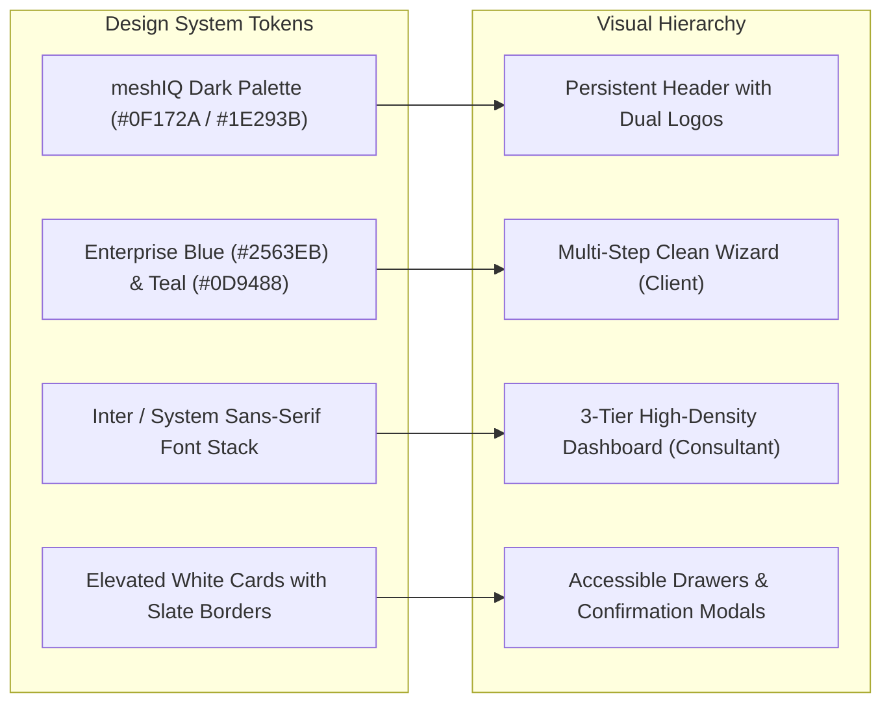

# 13. UI/UX Design System & Branding Guidelines

> **Authoritative Scope**: Design language, color palettes, typography, components, responsive layouts, accessibility (a11y), co-branding rules.  
> **Status**: IMPLEMENTED / CO-BRANDED

---

## 1. Visual Identity & Co-Branding Framework

The platform presents a modern, enterprise-grade, authoritative interface co-branded by **DATAEKO** (AI-driven economic benchmarking) and **meshIQ** (The Integration Observability Leader).

---

## 2. Color Palette & Token Catalog

| Color Token | Hex / CSS Class | Application & Semantic Meaning |
|:---|:---|:---|
| **Primary Brand Navy** | `#0F172A` (`bg-slate-900`) | Header background, executive typography, primary emphasis. |
| **Brand Accent Blue** | `#2563EB` (`bg-blue-600`) | Primary action buttons, progress bars, active step badges. |
| **Accent Teal / Green** | `#0D9488` (`text-teal-600`) | Illustrative gains, positive recovery, meshIQ observability highlights. |
| **Exposure / Warning** | `#DC2626` (`text-red-600`) | Operational risk, business exposure, downtime indicators. |
| **Card Background** | `#FFFFFF` (`bg-white`) | Clean container surfaces, elevated panels. |
| **Border / Divider** | `#E2E8F0` (`border-slate-200`)| Subtle boundary separation for high readability. |
| **Subtle Background** | `#F8FAFC` (`bg-slate-50`) | Page body background, inactive tab containers. |

---

## 3. Typography & Information Hierarchy

* **Font Stack**: `Inter, -apple-system, BlinkMacSystemFont, "Segoe UI", Roboto, sans-serif`
* **Hierarchy**:
  * **Page Titles (H1)**: `text-2xl font-bold text-slate-900`
  * **Section Headers (H2)**: `text-lg font-semibold text-slate-800`
  * **Card / Drawer Titles (H3)**: `text-md font-medium text-slate-700`
  * **KPI Values**: `text-3xl font-extrabold text-slate-900 tabular-nums`
  * **Body / Question Text**: `text-sm text-slate-600 leading-relaxed`
  * **Helper / Sub-labels**: `text-xs text-slate-400`

---

## 4. Key UI Patterns & Component Guidelines

### 4.1 Client Wizard Patterns (`02_CLIENT_EXPERIENCE.md`)
* **Clean Single-Question Focus**: Questions are presented in clean vertical groupings per section.
* **Sticky Navigation Footer**: "Previous" and "Next Section" buttons are always pinned and accessible.
* **Autosave Indicators**: Discreet "Saving..." / "Saved" status badge in the header.
* **Section Progress Rail**: Interactive step breadcrumb displaying completed, active, and pending sections.

### 4.2 Consultant Dashboard Patterns (`03_CONSULTANT_EXPERIENCE.md`)
* **KPI Metric Cards**: Elevated cards with clear label, large tabular metric, subtitle, and inline "Show the Math" trigger button.
* **Provenance Drawer ("Show the Math")**: Slides out smoothly from the right, providing formula LaTeX rendering, input variable breakdown, and calculation steps.
* **Scenario Sandbox**: Interactive sliders with immediate, client-side preview and distinct "Illustrative Gain" callouts.

---

## 5. Accessibility (a11y) & Usability Standards

* **Keyboard Navigation**: All interactive elements (inputs, radio options, dropdowns, drawer triggers) support standard `Tab`, `Space`, and `Enter` keystrokes.
* **ARIA Attributes**: Drawers and modals utilize `aria-modal="true"`, `role="dialog"`, and explicit `aria-labelledby` bindings.
* **Color Contrast**: All text elements meet **WCAG 2.1 AA** contrast ratios (minimum 4.5:1 for normal text, 3:1 for large text).
* **Tabular Numbers**: Numeric KPI readouts use `tabular-nums` CSS property to prevent jitter during updates.

---

## 6. UI Improvement Opportunities (Non-Breaking)

> [!NOTE]
> The following enhancements are safe to implement because they touch only presentation layers and do not modify underlying calculations.

1. **Skeleton Loaders**: Replace spinner modals with content-shaped skeleton screens during calculation runs.
2. **Inline Input Validation Tooltips**: Display real-time validation warnings adjacent to invalid input fields.
3. **Export Dropdown Consolidation**: Combine "Download PDF" and "Export CSV" into a unified dropdown button with loading state feedback.
4. **Dark Mode Toggle for Consultant Workspace**: Provide an optional dark theme for high-density analysis.
