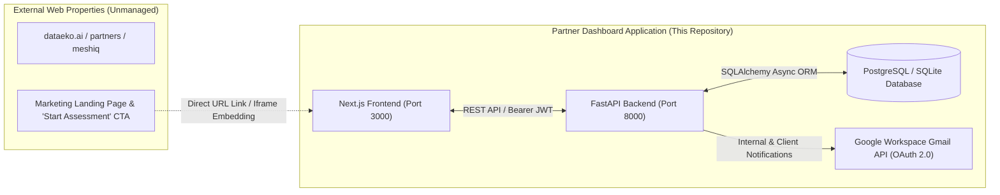
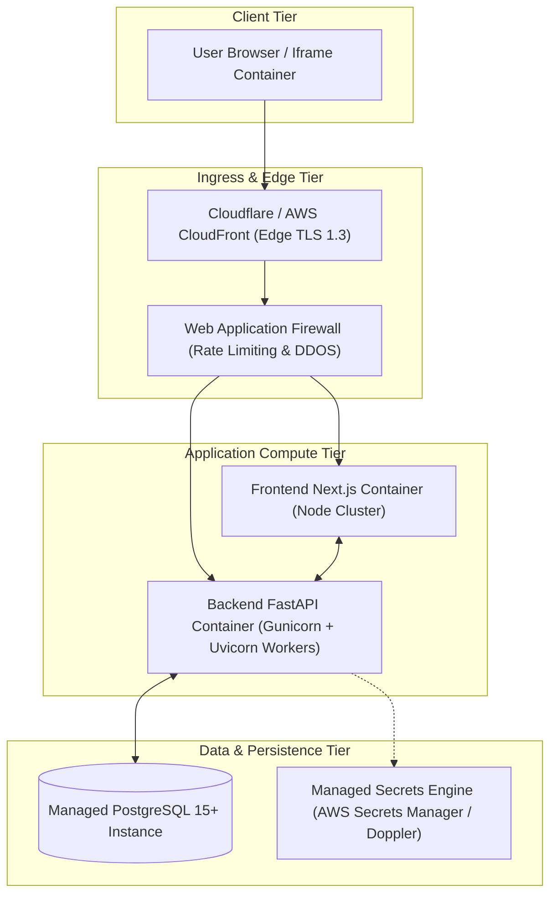

# 14. Integration, Deployment, and External Architecture

> **Authoritative Scope**: Local development setup, production deployment topology, external website boundaries, iframe integration architecture, CORS/CSP policies, environment variables.  
> **Status**: IMPLEMENTED (Local) / SPECIFIED (Production & External Integration)

---

## 1. External Website Boundary Rule

> [!IMPORTANT]
> **STRICT REPOSITORY ISOLATION CONTRACT**:  
> No external websites (including `https://dataeko.ai`, `https://dataeko.ai/partners/meshiq`, or `https://meshiq.com`) are modified from this repository.  
> External partner portal pages and marketing CTAs are managed independently by executive stakeholders.



---

## 2. Local Development Architecture

* **Frontend**: Next.js 16 (App Router) running on `http://localhost:3000`
* **Backend**: FastAPI running on `http://localhost:8000` via `uvicorn app.main:app --reload`
* **Database**: SQLite `assessment.db` (local dev) with full WAL mode support
* **Virtual Environment**: Python 3.11+ venv in `backend/.venv`
* **Node Environment**: Node.js 18+ with `npm` dependencies

---

## 3. Production Deployment Architecture (Target State)



---

## 4. Environment Variables & Secret Configuration

| Variable Name | Environment | Purpose & Secret Classification |
|:---|:---|:---|
| `DATABASE_URL` | Local / Prod | Database connection string. **CRITICAL SECRET**. |
| `SECRET_KEY` | Local / Prod | JWT signing key (HS256 / RS256). **CRITICAL SECRET**. |
| `ALGORITHM` | Local / Prod | JWT algorithm (Default: `HS256`). |
| `ACCESS_TOKEN_EXPIRE_MINUTES` | Local / Prod | JWT session duration (Default: `60`). |
| `CORS_ORIGINS` | Local / Prod | Allowed origins for browser API calls. |
| `GOOGLE_CREDENTIALS_JSON` | Prod | Service account OAuth keys for Gmail API. **CRITICAL SECRET**. |
| `NEXT_PUBLIC_API_URL` | Local / Prod | Frontend client pointer to backend base URL. |

---

## 5. Iframe Embedding & Security Policies (Target Architecture)

When embedded into partner portals (`dataeko.ai/partners/meshiq`), the following security headers and iframe attributes must be configured:

### 5.1 Content Security Policy (CSP) & Frame Ancestors
* **Backend Header**:
  ```http
  Content-Security-Policy: frame-ancestors 'self' https://dataeko.ai https://*.dataeko.ai https://meshiq.com https://*.meshiq.com;
  ```
* **X-Frame-Options**: Must be omitted or set to `ALLOW-FROM` to prevent conflicts with modern CSP `frame-ancestors`.

### 5.2 Cookie & Session Configuration for Iframes
* **SameSite Policy**: `SameSite=None` with `Secure=true` is required for cross-site cookie transmission inside iframe contexts.
* **Alternative (Recommended)**: Use `Authorization: Bearer <token>` stored in memory / sessionStorage to avoid third-party cookie blocking in modern browsers (Safari ITP, Chrome Privacy Sandbox).

### 5.3 PostMessage Communication Protocol (Planned)
* To support dynamic iframe height resizing without scrolling jitter:
  ```javascript
  // Frontend sends height message to parent window
  window.parent.postMessage({ type: 'MESHIQ_ASSESSMENT_RESIZE', height: document.body.scrollHeight }, 'https://dataeko.ai');
  ```
