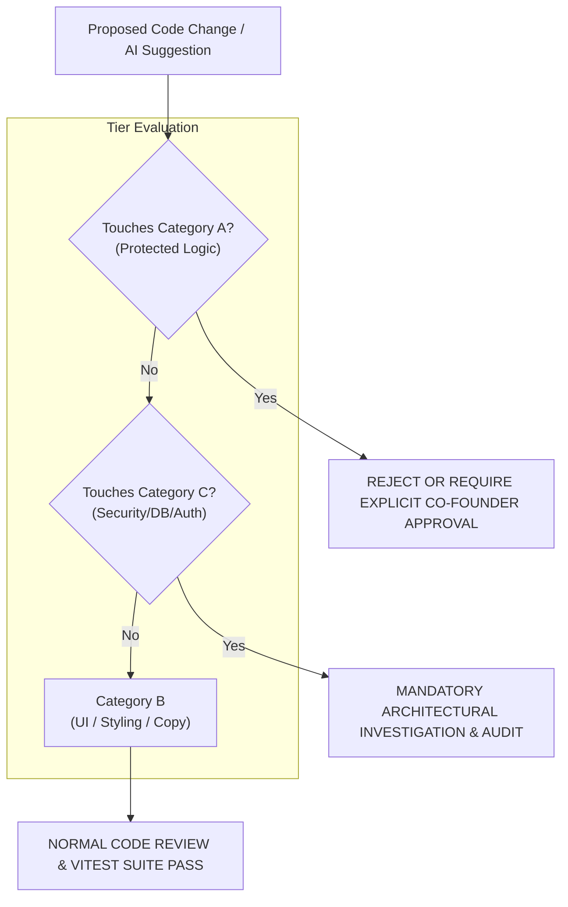

# 15. Protected Areas and Change Management Rules

> **Authoritative Scope**: Categorization of codebase components into Protected, Changeable, and Investigation-Required tiers, formal change impact checklist, governance rules.  
> **Status**: STRICT GOVERNANCE POLICY

---

## 1. Governance Overview

To ensure the long-term integrity, mathematical authority, and security of the DATAEKO × meshIQ platform, all prospective changes must be evaluated against strict classification rules.



---

## 2. Component Classification Tiers

### Category A: DO NOT CHANGE WITHOUT EXPLICIT APPROVAL (PROTECTED)
The following components are **FROZEN**. An AI or engineer must never alter these without formal executive authorization:
1. **Calculation Engine Formulas**: All equations in `backend/app/calculation_engine/`.
2. **Benchmark Constants & Lookup Tables**: Hourly rates ($100/hr, $125/hr), downtime cost lookup tables, recovery multipliers ($0.30, 0.40, 0.50$).
3. **Q01–Q22 Semantics & Mapping**: The business meaning and enum definitions of all 22 questions.
4. **Q04 Quarterly Intake Rule**: Exact numeric quarterly intake annualized via $\times 4$.
5. **Pure Decimal Math**: Prohibition of floating-point math in financial calculations.
6. **CalculationSnapshot Immutability**: Write-once rule for calculation snapshot records.
7. **Golden Master Test Fixtures**: Frozen benchmarks in `test_golden_masters.py`.
8. **Tenant Isolation Enforcements**: Multi-tenant customer separation query filters.

### Category B: CHANGEABLE WITH NORMAL REVIEW (UNRESTRICTED)
The following areas are safe for ongoing enhancement and polish:
1. **UI Layout & Styling**: CSS styling, colors, padding, responsive adjustments, Tailwind utility tweaks.
2. **Help Text & Micro-copy**: Explanatory tooltips, non-authoritative question descriptions.
3. **Loading States & Skeletons**: Adding smooth spinner and skeleton animations.
4. **Accessibility Enhancements**: ARIA tags, keyboard focus rings, color contrast refinements.
5. **Chart Presentation**: Non-authoritative chart visual adjustments (preserving data values).
6. **Documentation & AI Context**: Updating and enriching Markdown knowledge bases.

### Category C: REQUIRES INVESTIGATION FIRST (CAUTION)
The following areas may be modified only after detailed design review and dependency analysis:
1. **Authentication & Token Expiry**: Modifications to JWT lifecycles, refresh tokens, or password hashing.
2. **Database Migrations & Schemas**: Adding columns, indexes, or altering constraints.
3. **Email Delivery & Templates**: Changing Gmail API integration or email body formats.
4. **PDF Generation Pipeline**: Adjusting Playwright headless rendering or CSS print stylesheets.
5. **Role Capabilities (RBAC)**: Granting new permissions to existing user roles.
6. **API Route Signatures**: Adding new endpoints or expanding request payloads.

---

## 3. Formal Change Impact Checklist

Any AI assistant or developer preparing a pull request must complete this checklist:

```markdown
### Change Impact Evaluation
- [ ] 1. Does this change alter any file in `backend/app/calculation_engine/`? (If YES, STOP: Category A).
- [ ] 2. Does this change modify Q04 intake from quarterly to annual or range? (If YES, STOP: Category A).
- [ ] 3. Does this change modify any Golden Master test or fixture? (If YES, STOP: Category A).
- [ ] 4. Does this change introduce floating-point arithmetic (`float()`, `Number()`) to metrics? (If YES, STOP: Category A).
- [ ] 5. Does this change alter database schemas or Alembic migrations? (If YES: Category C Investigation Required).
- [ ] 6. Does this change touch authentication, JWT, or RBAC guards? (If YES: Category C Investigation Required).
- [ ] 7. Have all backend tests passed (`pytest`)?
- [ ] 8. Have all frontend tests passed (`npm test`)?
- [ ] 9. Has TypeScript compiled with zero errors (`tsc --noEmit`)?
```
