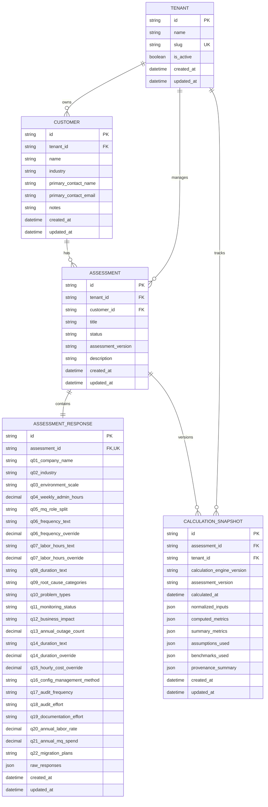

# Backend Database & Persistence Architecture Specification

**Version:** 1.0.0 (Phase 4 Delivery)  
**Status:** VALIDATED  
**Classification:** Enterprise Multi-Tenant Relational Foundation & Immutable Calculation Snapshots

---

## 1. Domain Model Architecture

The persistence layer is implemented with **SQLAlchemy 2.0 (Async)** and migrated via **Alembic**. It centers around 5 core relational entities:

---

## 2. Calculation Engine Integration & Single Source of Truth

The backend adheres strictly to the rule that **the calculation engine is the single source of calculation truth**:
* Zero formulas or business calculations exist in FastAPI routes, services, database models, or SQL queries.
* When calculation is requested (`POST /api/v1/assessments/{id}/calculate`), `CalculationService` extracts the stored responses, creates an `AssessmentInputs` dataclass, and executes `calculate_assessment(inputs)`.
* The resulting `CalculationResults` are serialized and stored as an immutable `CalculationSnapshot`.

---

## 3. Transaction Boundaries

1. **Response Persistence**:
   - Updates to `assessment_responses` are transactional.
   - If the assessment was in `DRAFT` status, it atomically transitions to `IN_PROGRESS`.
2. **Calculation Execution & Snapshot Persistence**:
   - `CalculationSnapshot` creation and assessment transition to `CALCULATED` status occur in a single atomic database transaction.
   - If snapshot insertion fails, status changes are rolled back.
3. **Assessment Deletion**:
   - Deleting an `Assessment` cascades to its `AssessmentResponse` and all associated `CalculationSnapshot` rows.

---

## 4. Multi-Tenant Security & Defense in Depth

* Every database query is scoped to `tenant_id` supplied via header `X-Tenant-ID` (with a secure default for single-tenant mode).
* Foreign keys enforce tenant consistency across customers, assessments, and snapshots.
* Direct object references without tenant scoping (anti-IDOR) are prohibited at the repository/service layer.

---

## 5. API Endpoints Catalog (`/api/v1`)

| Method | Path | Summary | Transaction Scope |
| :--- | :--- | :--- | :--- |
| `GET` | `/health` | System, database, and calculation engine health check. | Read-only |
| `POST` | `/customers` | Create a new enterprise customer record. | Commit on success |
| `GET` | `/customers` | List customers for current tenant. | Read-only |
| `GET` | `/customers/{id}` | Get customer details. | Read-only |
| `PUT` | `/customers/{id}` | Update customer details. | Commit on success |
| `DELETE` | `/customers/{id}` | Delete customer and cascade. | Commit on success |
| `POST` | `/assessments` | Create assessment for a verified customer. | Commit on success |
| `GET` | `/assessments` | List assessments (optional `customer_id` filter). | Read-only |
| `GET` | `/assessments/{id}` | Get assessment detail (with customer, responses, latest snapshot). | Read-only |
| `PUT` | `/assessments/{id}` | Update assessment metadata (title, description, status). | Commit on success |
| `PUT` | `/assessments/{id}/responses` | Save or update Q01-Q22 responses (transitions to `IN_PROGRESS`). | Atomic commit |
| `GET` | `/assessments/{id}/responses` | Retrieve saved responses. | Read-only |
| `POST` | `/assessments/{id}/calculate` | Run calculation engine & persist immutable snapshot. | Atomic commit |
| `GET` | `/assessments/{id}/snapshots` | List historical calculation snapshots. | Read-only |
| `GET` | `/assessments/{id}/snapshots/latest` | Retrieve latest calculation snapshot. | Read-only |
| `DELETE` | `/assessments/{id}` | Delete assessment and cascade. | Commit on success |
