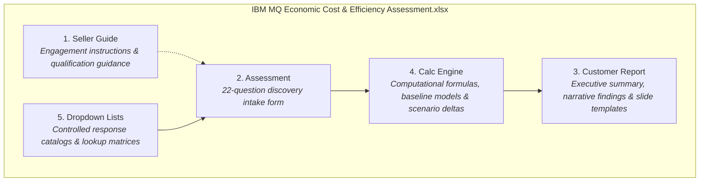

# IBM MQ Economic Cost & Efficiency Assessment — Business Specification

> **Document Status**: `AUTHORITATIVE BUSINESS SPECIFICATION`  
> **Source Artifact**: `IBM MQ Economic Cost & Efficiency Assessment.xlsx`  
> **Classification Standard**: `[CONFIRMED]`, `[INFERENCE]`, `[RECOMMENDATION]`, `[OPEN BUSINESS QUESTION]`, `[SOURCE INCONSISTENCY]`

---

## 1. Executive Purpose & Scope

`[CONFIRMED]` The **IBM MQ Economic Cost & Efficiency Assessment** is a specialized consulting discovery framework designed for Dataeko consultants and meshIQ specialists to evaluate enterprise IBM MQ messaging estates.

The assessment quantitatively and qualitatively captures:
1. **Operating & Administration Effort**: The labor and time overhead required to maintain, patch, configure, and operate IBM MQ queue managers across distributed, mainframe, and cloud topologies.
2. **Troubleshooting & Diagnostic Friction**: The frequency, duration, and engineering staff commitment consumed by queue issues, stuck messages, channel disconnects, and message loss investigations.
3. **Productivity Reclamation Capacity**: The potential person-hours and full-time equivalent (FTE) capacity recoverable through automated correlation, 360-degree message tracing, and self-healing management via meshIQ.
4. **Business Disruption & Outage Exposure**: The financial, operational, and reputational risk exposure incurred when critical MQ messaging infrastructure suffers downtime.
5. **Organizational & Cost Mandates**: Corporate cost-reduction targets, resource constraints, and operational efficiency initiatives.
6. **Cybersecurity & Remediation Pressure**: Regulatory compliance, audit readiness, security vulnerability patching, and access governance overheads.
7. **Timing to Act**: The organization's timeline and appetite to demonstrate tangible operational improvement.

---

## 2. Core Business Principles & Boundaries

* `[CONFIRMED]` **Discovery & Qualification Tool**: The assessment produces quantified *evidence* and directional indicators to qualify whether a deeper technical engagement (e.g., a 60-minute meshIQ working session or technical proof of concept) is warranted.
* `[CONFIRMED]` **No Manufactured Guarantees**: Soft productivity benefits (reclaimed engineering hours) and illustrative efficiency models must **never** be presented to customer executives as guaranteed hard-dollar contractual savings.
* `[CONFIRMED]` **Customer Primacy**: Real customer telemetry and customer-provided cost metrics always take precedence over default industry benchmarks.
* `[CONFIRMED]` **Validity of Missing Data**: "Not sure", "Unknown", and unprovided values are valid assessment states. They must never be silently converted to zero or replaced with assumptions without clear provenance badging.

---

## 3. Legacy Workbook Structure

The legacy Excel workbook comprises five functional worksheets:

---

## 4. Seller Guide Rules & Consulting Methodology

`[CONFIRMED]` The Seller Guide establishes the following consulting protocols:

1. **Conversational Discovery**: The assessment is completed interactively with the customer during an interview session, not sent as a cold, standalone survey.
2. **Total Resource Scope**: Total IBM MQ effort must capture both *dedicated MQ specialists* and *shared infrastructure/middleware engineers* who manage MQ alongside other responsibilities.
3. **Quarterly Administration Input**: Administration effort is captured in *quarterly hours* to normalize seasonal patching and maintenance cycles.
4. **Customer Precedence**: Customer-provided values (e.g., actual loaded labor rate, direct financial downtime impact) always override default assumptions.
5. **Working Session Qualification**: If the assessment identifies substantial operational labor overhead, frequent troubleshooting friction, or significant downtime risk, a follow-up **60-minute meshIQ Technical Working Session** is recommended.
6. **Environment Validation**: Findings and illustrative calculations must be explicitly validated against the customer's actual environment during technical discovery.
