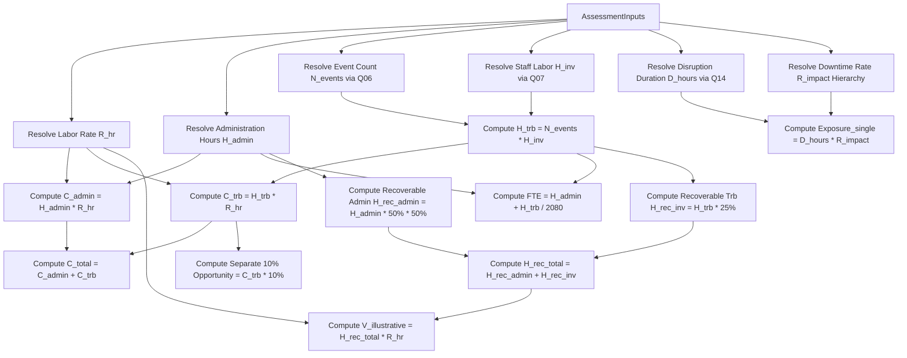

# Calculation Engine Architecture Specification

**Version:** 1.0.0 (Phase 3 Delivery)  
**Status:** VALIDATED  
**Classification:** Pure Deterministic Computation Engine (In-Memory Core)

---

## 1. Package Architecture Overview

The calculation engine is implemented as an isolated, deterministic Python package located under `backend/app/calculation_engine/`. It contains zero dependencies on external databases, web frameworks (FastAPI/ASGI), I/O subsystems, or frontend components. It relies exclusively on Python standard library modules (`decimal.Decimal`, `dataclasses`, `enum`, `typing`).

```text
backend/app/calculation_engine/
├── __init__.py          # Export interface (AssessmentInputs, CalculationResults, calculate_assessment)
├── constants.py         # Standard constants (2,080 hrs, $180k labor rate, $300k ITIC, scenario factors)
├── enums.py             # CalculationState and DataProvenanceTier definitions
├── lookups.py           # Strict lookup mappings for Q06, Q07, and Q14 with text normalization
├── models.py            # Strongly typed AssessmentInputs, MetricResult, and CalculationResults
└── engine.py            # Deterministic calculation pipeline and dependency graph evaluation
```

---

## 2. Input Contract (`AssessmentInputs`)

The engine accepts a strongly typed dataclass containing raw customer answers and optional fact overrides:

| Field | Type | Required | Description |
| :--- | :--- | :--- | :--- |
| `q04_weekly_admin_hours` | `Optional[Decimal]` | No | Raw weekly administration hours spent by team (Q04). |
| `q06_frequency_text` | `Optional[str]` | No | Raw dropdown string for problem frequency (Q06). |
| `q06_frequency_override` | `Optional[Decimal]` | No | Exact annual event count override. |
| `q07_labor_hours_text` | `Optional[str]` | No | Raw dropdown string for staff labor per event (Q07). |
| `q07_labor_hours_override`| `Optional[Decimal]` | No | Exact staff labor hours per event override. |
| `q08_duration_text` | `Optional[str]` | No | Elapsed investigation duration context string (Q08). |
| `q11_monitoring_status` | `Optional[str]` | No | Customer monitoring tooling & tracking context (Q11). |
| `q12_business_impact` | `Optional[str]` | No | Impact severity tier (`Minimal`, `Moderate`, `Significant`, `Critical`). |
| `q14_duration_text` | `Optional[str]` | No | Outage duration per major incident dropdown string (Q14). |
| `q14_duration_override` | `Optional[Decimal]` | No | Exact outage duration hours override. |
| `q15_hourly_cost_override`| `Optional[Decimal]` | No | Customer-provided hourly downtime impact cost. |
| `q18_audit_effort` | `Optional[str]` | No | Contextual audit prep effort tier (Q18). |
| `q19_documentation_effort`| `Optional[str]` | No | Contextual config drift & doc effort tier (Q19). |
| `q20_annual_labor_rate` | `Optional[Decimal]` | No | Customer-provided fully burdened annual salary. |
| `q21_annual_mq_spend` | `Optional[Decimal]` | No | Customer-reported annual MQ license/infra spend. |

---

## 3. Output Contract (`CalculationResults`)

Every computed metric is wrapped inside a `MetricResult` container providing full audit provenance and state transparency:

```python
@dataclass(frozen=True)
class MetricResult:
    value: Optional[Decimal]           # Exact Decimal value, or None if invalid/unmodeled
    state: CalculationState            # VALID, INSUFFICIENT_DATA, NOT_MODELED, etc.
    provenance: DataProvenanceTier     # FACT, BENCHMARK, MODEL_ASSUMPTION, etc.
    formula_code: Optional[str]        # Traceable formal formula identifier
    rule_version: str                  # Engine rule set version ("3.0.0")
    inputs_used: Dict[str, Any]        # Lineage inputs snapshot
    state_reason: Optional[str]        # Human-readable explanation when not VALID
```

### Calculated Metrics Catalog

1. **Administration Labor**:
   - `admin_annual_hours` ($H_{admin} = Q04 \times 4 \times 52 / 52 = Q04 \times 4$ in legacy spec)
   - `admin_annual_cost` ($C_{admin} = H_{admin} \times R_{hr}$)
2. **Troubleshooting Labor**:
   - `annual_troubleshooting_events` ($N_{events} = \text{lookup}(Q06)$)
   - `labor_hours_per_event` ($H_{inv} = \text{lookup}(Q07)$)
   - `annual_troubleshooting_hours` ($H_{trb} = N_{events} \times H_{inv}$)
   - `troubleshooting_annual_cost` ($C_{trb} = H_{trb} \times R_{hr}$)
3. **Operational Totals**:
   - `total_operational_labor_cost` ($C_{total} = C_{admin} + C_{trb}$)
   - `operational_fte_burden` ($\text{FTE} = (H_{admin} + H_{trb}) / 2080$)
   - `hourly_loaded_labor_rate` ($R_{hr} = Q20 / 2080$ or $\$180,000 / 2080$)
4. **Disruption Exposure**:
   - `disruption_duration_hours` ($D_{hours} = \text{lookup}(Q14)$)
   - `hourly_downtime_rate` ($R_{impact}$ resolved via 3-tier hierarchy)
   - `representative_single_event_exposure` ($\text{Exposure}_{single} = D_{hours} \times R_{impact}$)
5. **meshIQ Improvement Scenarios**:
   - `recoverable_admin_hours` ($H_{rec\_admin} = H_{admin} \times 0.50 \times 0.50$)
   - `recoverable_troubleshooting_hours` ($H_{rec\_inv} = H_{trb} \times 0.25$)
   - `total_recoverable_labor_hours` ($H_{rec\_total} = H_{rec\_admin} + H_{rec\_inv}$)
   - `illustrative_annual_labor_savings` ($V_{illustrative} = H_{rec\_total} \times R_{hr}$)
6. **Separate 10% Troubleshooting Productivity Opportunity**:
   - `troubleshooting_productivity_opportunity` ($\text{Opportunity}_{trb} = C_{trb} \times 0.10$)
7. **Preserved Contextual Facts**:
   - `q08_investigation_clock_duration` (contextual elapsed time)
   - `q21_customer_reported_mq_spend` (isolated customer fact)

---

## 4. Execution Pipeline & Dependency Flow



---

## 5. Lookup Mapping Tables

### Q06 Problem Frequency Lookup
| Dropdown Label | Normalized Lookup Key | Annual Multiplier ($N_{events}$) |
| :--- | :--- | :--- |
| `Daily` | `DAILY` | 250 |
| `Weekly` | `WEEKLY` | 50 |
| `Monthly` | `MONTHLY` | 12 |
| `Rarely` | `RARELY` | 2 |
| `Never` | `NEVER` | 0 |
| `Not sure` | `NOT_SURE` | `INSUFFICIENT_DATA` |

### Q07 Staff Investigation Effort Lookup
| Dropdown Label | Normalized Lookup Key | Staff Labor Hours ($H_{inv}$) |
| :--- | :--- | :--- |
| `< 1 hour` | `LT_1_HOUR` | 0.5 |
| `1-4 hours` | `1_4_HOURS` | 2.5 |
| `4-8 hours` | `4_8_HOURS` | 6.0 |
| `> 8 hours` | `GT_8_HOURS` | 12.0 |
| `Varies significantly` | `VARIES_SIGNIFICANTLY` | `INSUFFICIENT_DATA` (Unmapped in legacy sheet) |
| `Not sure` | `NOT_SURE` | `INSUFFICIENT_DATA` |

### Q14 Major Disruption Duration Lookup
| Dropdown Label | Normalized Lookup Key | Outage Duration Hours ($D_{hours}$) |
| :--- | :--- | :--- |
| `< 15 minutes` | `LT_15_MIN` | 0.125 (7.5 min midpoint) |
| `15-30 minutes` | `15_30_MIN` | 0.375 (22.5 min midpoint) |
| `30-60 minutes` | `30_60_MIN` | 0.75 (45.0 min midpoint) |
| `1-2 hours` | `1_2_HOURS` | 1.5 |
| `2-4 hours` | `2_4_HOURS` | 3.0 |
| `> 4 hours` | `GT_4_HOURS` | 6.0 |
| `Never had one` | `NEVER` | 0.0 |
| `Not sure` | `NOT_SURE` | `INSUFFICIENT_DATA` |

---

## 6. Downtime Hourly Rate ($R_{impact}$) Fallback Hierarchy

The engine implements the strict 3-tier hierarchy for resolving financial downtime rate:

1. **Customer Direct Override (Tier 1 - Fact)**: If `q15_hourly_cost_override` is supplied and $> 0$, use this exact value.
2. **ITIC Industry Benchmark (Tier 2 - Benchmark)**: If Q15 is blank/unprovided:
   - If `q12_business_impact` is `Significant` or `Critical`, apply ITIC benchmark of **$300,000.00 / hour**.
3. **Not Modeled / Insufficient Data (Tier 5 / State)**:
   - If `q12_business_impact` is `Minimal` or `Moderate`, downtime is classified as `CalculationState.NOT_MODELED`.
   - If Q12 is blank or `Not sure`, downtime is classified as `CalculationState.INSUFFICIENT_DATA`.

---

## 7. Precision Policy

* **Financial Arithmetic**: Conducted strictly using standard library `Decimal`.
* **Standard Working Year**: Exactly $2,080$ hours per year ($40\text{ hrs/wk} \times 52\text{ wks}$).
* **Unrounded Internal Rates**: The default loaded rate $R_{hr} = 180000 / 2080 = 86.53846153846153846153846154...$ retains full decimal precision across all intermediate multiplications ($C_{admin}, C_{trb}, V_{illustrative}$).
* **No Premature Rounding**: The calculation engine performs NO rounding to 2 decimal places. Rounding is solely a presentation/display concern.

---

## 8. Test Strategy & Verification

The calculation engine is accompanied by an exhaustive test suite under `backend/tests/calculation_engine/`:
* `test_golden_masters.py`: TC-01 through TC-10 validating exact baseline behavior against legacy assessment specifications.
* `test_precision.py`: Verifying unrounded Decimal precision and exact multiplication.
* `test_lookups.py`: Verifying all valid dropdown keys, case insensitivity, whitespace trimming, and unmapped variants.
* `test_boundary_and_edge_cases.py`: Verifying Q15 hierarchy branches, Q21 isolation, zero friction limits, and partial inputs.
* `test_scenarios.py`: Verifying $50\% \times 50\%$ admin decomposition vs $25\%$ troubleshooting recovery and distinct $10\%$ opportunity.
